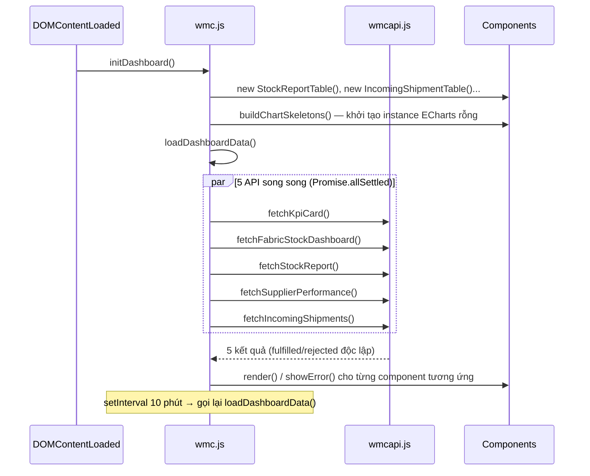

# WMC Dashboard — Kiến trúc Frontend

> [!info] Phạm vi tài liệu
> Tài liệu này mô tả kiến trúc frontend của **WMC Dashboard** (`/IGM/WMC/Index`) — màn hình TV wall hiển thị số liệu kho vải (Fabric Warehouse) theo thời gian thực. Không bao gồm chi tiết backend (ASP.NET Core / MySQL), chỉ nhắc tới khi liên quan trực tiếp tới hành vi frontend.

---

## 1. Tổng quan hệ thống

```
Trình duyệt (TV Wall, không tương tác người dùng)
        │
        ▼
   wmc.js  ◄─── "Nhạc trưởng điều phối" — điểm vào duy nhất
        │
        ├── wmcapi.js      → tầng gọi API (fetch tập trung, chuẩn hoá response)
        ├── wmchelpers.js  → tiện ích dùng chung (số, ngày, ngôn ngữ, loading UI...)
        │
        ├── charts/
        │     ├── stockDonutChart.js           (Donut — Stock by Customer)
        │     ├── supplierPerformanceChart.js   (Stacked bar — Supplier Performance)
        │     └── YardCapacityGauges.js         (Gauge 2×4 — Yard Capacity)
        │
        └── tables/
              ├── stockReportTable.js       (Bảng — Stock Report theo KH/Mùa vụ)
              └── incomingShipmentTable.js  (Bảng — Incoming Shipments)
```

**Nguyên tắc thiết kế cốt lõi:**
- `wmc.js` **không** tự vẽ chart/bảng — nó chỉ gọi API và đẩy dữ liệu vào các **component class** (mỗi chart/bảng là 1 class riêng, tự quản lý vòng đời DOM/ECharts của chính nó).
- Mọi lệnh gọi API đi qua **1 tầng duy nhất** (`wmcapi.js`) — không có `fetch()` rải rác trong các file khác.
- Mọi tiện ích dùng chung (format số, format ngày, trạng thái loading...) nằm trong **`wmchelpers.js`** — không component nào tự định nghĩa lại logic đã có sẵn.

---

## 2. Vòng đời tải dữ liệu (Data Loading Lifecycle)

### 2.1. Nhóm 5 API chính — refresh mỗi 10 phút



**Các quyết định thiết kế quan trọng:**

| Quyết định | Lý do |
|---|---|
| Gọi 5 API bằng `Promise.allSettled` thay vì `await` tuần tự | Thời gian tải = API **chậm nhất**, không phải tổng cộng tất cả. Đây là tối ưu hiệu năng lớn nhất của toàn dashboard. |
| Cờ `isDashboardLoading` (re-entrancy guard) | Nếu 1 vòng tải chưa xong mà countdown 10 phút lại kích hoạt, **bỏ qua** thay vì bắn thêm request chồng lên. |
| Overlay loading toàn màn hình chỉ hiện ở **lần tải đầu tiên** (`isFirstLoad`) | Các lần auto-refresh sau không che UI — tránh chớp màn hình TV wall mỗi 10 phút. |
| `try { ... } finally { ẩn overlay, reset cờ }` bọc quanh phần render | Đảm bảo overlay **không bao giờ kẹt vĩnh viễn** dù có lỗi runtime bất ngờ ở bất kỳ bước render nào (bài học từ bug `renderError` — xem [[#7. Changelog]]). |

### 2.2. Yard Capacity Gauges — refresh riêng mỗi 30 giây

Cụm 8 gauge (A–H) **tách biệt hoàn toàn** khỏi vòng 10 phút ở trên, vì API `/api/yard-capacity` có cache backend chỉ 30s (dữ liệu sức chứa kho cần "tươi" hơn số liệu tồn kho tổng quan).

- Khởi tạo & vòng lặp riêng: `setupYardCapacityGauges()` trong `wmc.js`.
- Cờ chống gọi chồng riêng: `isYardGaugesLoading` (độc lập với `isDashboardLoading`).
- **Không** thêm `resize` listener riêng — đăng ký instance vào `globalCharts` để dùng chung cơ chế debounce (xem mục 4).

> [!warning] Cần lưu ý khi bảo trì
> Có **2 timer độc lập** chạy song song trong trang (10 phút và 30 giây). Nếu sau này thêm API mới, cân nhắc kỹ nó thuộc nhóm nào trước khi quyết định gộp vào `loadDashboardData()` hay tạo vòng lặp riêng.

---

## 3. Tầng API — `wmcapi.js`

Toàn bộ lệnh gọi API đi qua 1 hàm nội bộ duy nhất: **`fetchGeneric(url, errorMessage)`**.

```js
async function fetchGeneric(url, errorMessage) {
    // 1. fetch() + kiểm tra response.ok
    // 2. Kiểm tra body rỗng (server trả về "" thay vì JSON hợp lệ)
    // 3. JSON.parse() an toàn
    // 4. Chuẩn hoá về { isSuccess, status, data, message }
    // 5. catch mọi lỗi mạng/parse → trả về { isSuccess: false, data: [], message }
}
```

Mỗi API export ra 1 hàm mỏng gọi `fetchGeneric` với URL + message lỗi tương ứng — **không** component nào được tự viết `fetch()` thô.

| Hàm export | Endpoint | Dùng bởi |
|---|---|---|
| `fetchKpiCard(fromDate, brand)` | `/api/KpiCard` | KPI cards (text, không qua component riêng) |
| `fetchFabricStockDashboard(fromDate)` | `/api/FabricStock` | `StockDonutChart` + Material Class bar chart |
| `fetchStockReport(warehouse)` | `/api/StockReport` | `StockReportTable` |
| `fetchSupplierPerformance(warehouse)` | `/api/performance` | `SupplierPerformanceChart` |
| `fetchIncomingShipments(warehouse)` | `/api/incoming-shipments` | `IncomingShipmentTable` |
| `fetchYardCapacity(brand)` | `/api/yard-capacity` | `YardCapacityGauges` |

> [!tip] Vì sao chuẩn hoá `{ isSuccess, data, message }`?
> Toàn bộ component nhận dữ liệu từ đây đều có thể áp dụng chung 1 pattern:
> ```js
> if (apiResponse.isSuccess) { instance.render(apiResponse); }
> else { instance.showError(apiResponse.message); }
> ```
> Không cần biết chi tiết endpoint gốc trả về hình dạng JSON thế nào.

---

## 4. Tầng tiện ích dùng chung — `wmchelpers.js`

| Nhóm | Hàm chính | Ghi chú |
|---|---|---|
| Số liệu | `formatNumberByLocale()`, `animateValue()`, `updateElementWithAnimation()` | Format theo locale hiện tại (vi-VN / en-US / zh-TW) |
| Ngày tháng | `formatDateByLanguage()`, `isDateNotFuture()` | |
| Ngôn ngữ | `getCurrentLanguage()`, `setupLanguageDropdown()` | Phát `CustomEvent('wmc-language-changed')` toàn cục khi đổi ngôn ngữ |
| Bảo mật | `escapeHtml()` | **Bắt buộc** dùng trước khi chèn bất kỳ text nào từ API vào `innerHTML` |
| **Loading UI (dùng chung)** | `getEchartsLoadingOption()`, `getLoadingHtml()`, `WMC_LOADING_THEME` | Xem mục 4.1 |
| Khác | `showMessage()`, `handleApiError()`, `makeSafeId()`, `setupDatePicker()` | |

### 4.1. Chuẩn hoá trạng thái Loading (07/2026)

Trước đây mỗi component tự định nghĩa 1 kiểu loading riêng (màu, opacity mask, class Bootstrap khác nhau) → nhìn lệch tông trên TV wall. Đã gộp về **1 nguồn duy nhất**:

```js
// wmchelpers.js
export const WMC_LOADING_THEME = {
    color: '#29b6f6',
    textColor: '#8ba2c1',
    maskColorDefault: 'rgba(4, 20, 50, 0.7)',  // chart/bảng cỡ lớn
    maskColorSubtle:  'rgba(4, 20, 50, 0.4)'   // ô nhỏ (vd: từng gauge trong lưới 2x4)
};

export function getEchartsLoadingOption(overrides = {}) { /* dùng cho chart.showLoading() */ }
export function getLoadingHtml(message, options = {}) { /* dùng cho bảng render bằng innerHTML */ }
```

**Quy tắc bắt buộc khi thêm chart/bảng mới:**
- Component vẽ bằng ECharts → `showLoading()` phải gọi `this.chart.showLoading(getEchartsLoadingOption({...}))`.
- Component render bằng `innerHTML` (bảng HTML) → `showLoading()` phải gán `this.container.innerHTML = getLoadingHtml(text)`.
- **Không** hardcode lại `color`/`maskColor`/class Bootstrap riêng trong component — nếu cần đổi tông màu loading toàn hệ thống, chỉ sửa `WMC_LOADING_THEME`.

---

## 5. Pattern chuẩn của 1 Component (Chart hoặc Table)

Mọi class trong `charts/` và `tables/` tuân theo cùng 1 "giao diện" (interface) không chính thức:

```js
export default class XxxComponent {
    constructor(containerId, options = {}) { /* lấy DOM, khởi tạo ECharts nếu cần */ }

    showLoading()        { /* dùng getEchartsLoadingOption() hoặc getLoadingHtml() */ }
    showError(message)   { /* escapeHtml(message) trước khi hiển thị */ }
    render(apiResponse)  { /* unwrap {isSuccess,data,message}, vẽ lại toàn bộ (notMerge:true) */ }
    resize()              { /* echarts instance.resize(); table thường bỏ trống hàm này */ }
}
```

- `wmc.js` **luôn kiểm tra `typeof instance.xxx === 'function'`** trước khi gọi (defensive), vì không phải component nào cũng có đủ mọi hàm (vd: bảng HTML không cần `resize()`).
- Mọi instance có `resize()` được đăng ký vào `globalCharts[key]` (object toàn cục trong `wmc.js`) để dùng chung **1 listener `resize` đã debounce 150ms** — không component nào tự thêm `window.addEventListener('resize', ...)` riêng.
- Bảng HTML luôn dựng chuỗi bằng `array.map().join('')` (không dùng `+=` trong vòng lặp) để giảm số lần tạo chuỗi trung gian.
- Mọi field text đến từ API **phải** qua `escapeHtml()` trước khi chèn vào `innerHTML` (phòng XSS) — kể cả trong tooltip formatter của ECharts.

---

## 6. Danh sách Component chi tiết

### 6.1. `charts/stockDonutChart.js` — `StockDonutChart`
- Donut chart dùng chung cho mọi nhu cầu vẽ pie/donut trên dashboard (hiện đang phục vụ "Stock by Customer").
- Tự nhận diện 2 định dạng data đầu vào: `{value, name, itemStyle}` (chuẩn ECharts) hoặc `{quantity, categoryName, colorHex}` (dữ liệu report thô).
- Tuỳ chọn `centerTotal: {label, unit}` để hiện tổng ở giữa donut (dùng cho customerChart).

### 6.2. `charts/supplierPerformanceChart.js` — `SupplierPerformanceChart`
- Stacked bar chart ngang: Early / On-Time / Delayed theo từng nhà cung cấp.
- Lấy Top 15 supplier theo `totalOrders` (biến đặt tên `topSuppliersData`).
- Đánh dấu supplier "High Risk" bằng icon ⚠ — tra cứu qua `Set` (O(1)) thay vì `Array.find()` lặp lại mỗi lần redraw.
- Lấy màu từ CSS variables hệ thống (`getComputedStyle`) thay vì hardcode mã màu — tự đổi theo theme nếu CSS thay đổi.

### 6.3. `charts/YardCapacityGauges.js` — `YardCapacityGauges`
- Quản lý **cụm 8 gauge** (A–H) trong lưới 2×4, mỗi gauge là 1 instance ECharts riêng (`this.chartInstances[loc]`).
- `initGauges()` chủ động `dispose()` instance cũ trước khi tạo mới — tránh rò rỉ bộ nhớ khi render lại.
- Ngoài gauge, còn cập nhật trực tiếp badge Rolls/Yards trong DOM (`.gauge-badge-rolls`, `.gauge-badge-yards`) — component này vừa vẽ chart vừa thao tác DOM phụ trợ.

### 6.4. `tables/stockReportTable.js` — `StockReportTable`
- Bảng tồn kho theo Khách hàng/Mùa vụ, phân trang 8 dòng/trang, tự động xoay trang mỗi 7 giây (`startAutoPlay`).
- Sticky header, thanh tiến độ tỷ lệ xuất (`issRate`) vẽ bằng CSS thuần (không dùng chart).

### 6.5. `tables/incomingShipmentTable.js` — `IncomingShipmentTable`
- Bảng lô hàng đang vận chuyển, phân trang 7 dòng/trang, tự động xoay trang mỗi 5 phút.
- Tô màu badge trạng thái (Late/Arrived/In Transit) và cảnh báo supplier High Risk (nền gradient đỏ nhạt + icon ⚠).

---

## 7. Changelog (các đợt tối ưu quan trọng)

> [!note] Mục đích
> Ghi lại **vì sao** mã nguồn trông như hiện tại — tránh việc người bảo trì sau này vô tình "sửa lại" các quyết định đã có lý do rõ ràng.

- **Backend (IgmServices.cs / IgmRepository.cs):**
  - Phát hiện `/api/incoming-shipments` mất ~27.8s do gọi trùng lặp 1 query JOIN nặng 2 lần cùng lúc (chính nó gọi lại `GetSupplierPerformanceReportAsync` vốn không có cache, trong khi frontend đã song song hoá nên 2 endpoint tới server gần như đồng thời).
  - Fix: thêm cache 30s + **single-flight lock** (`SemaphoreSlim` theo cache key) để 2 request đồng thời chỉ chạy DB 1 lần; song song hoá 2 truy vấn độc lập bằng `Task.WhenAll`.
  - Fix phụ: bỏ hardcode mốc `'2026-01-01'` trong SQL (sẽ âm thầm trả sai dữ liệu từ 2027) → tính động theo năm hiện tại.

- **Frontend (`wmc.js`):**
  - Song song hoá 5 API chính bằng `Promise.allSettled` (trước đó `await` tuần tự).
  - Thêm re-entrancy guard (`isDashboardLoading`) và overlay chỉ hiện lần đầu (`isFirstLoad`).
  - Debounce `resize` (150ms), cache `Intl.DateTimeFormat` trong đồng hồ.
  - Chuyển `customerChart` từ hàm viết tay (`initChart`/`renderCustomerChart`) sang class `StockDonutChart` dùng chung.
  - Chuyển cụm gauge mock (`gaugeA`-`gaugeH` dữ liệu cứng) sang component thật `YardCapacityGauges` gọi API.
  - **Bug đã vá:** `stockReportTableInstance.renderError(msg, callback)` gọi 1 hàm **không tồn tại** (component chỉ có `showError(msg)`) → ném `TypeError` → `loadDashboardData()` dừng giữa chừng → loading overlay kẹt vĩnh viễn nếu `/api/StockReport` lỗi. Đã sửa thành `showError(msg)` + bọc `try/finally` toàn bộ khối render để lỗi runtime tương tự trong tương lai không còn gây kẹt UI.
  - Đồng bộ trạng thái loading của mọi chart/bảng về 2 hàm dùng chung trong `wmchelpers.js`: `getEchartsLoadingOption()` và `getLoadingHtml()`.

- **Dọn dẹp code rác:**
  - Xoá ~65 dòng `setupLanguageDropdown()` cũ bị comment trong `wmchelpers.js` (trùng với bản đang hoạt động).
  - Xoá JSDoc bị lặp đôi (`formatDateByLanguage`, `updateElementWithAnimation`).
  - Xoá import chết `formatDateByLanguage` ở cả `wmc.js` và `stockReportTable.js`.
  - Sửa biến/comment sai lệch trong `supplierPerformanceChart.js` (`top10Data` nhưng thực tế lấy 15 phần tử).

---

## 8. Việc cần làm tiếp (gợi ý, chưa triển khai)

- [ ] Cân nhắc áp dụng cùng chuẩn `getEchartsLoadingOption()`/`getLoadingHtml()` cho **trạng thái lỗi** (`showError`) — hiện tại mỗi component vẫn tự viết HTML lỗi riêng (icon, màu, layout hơi khác nhau).
- [ ] `StockReportTable.showError()` hiện dùng `onclick="location.reload()"` để "thử lại" (reload toàn trang) — có thể nâng cấp thành gọi lại đúng `loadDashboardData()` nếu muốn retry nhẹ hơn, không mất trạng thái các khối khác.
- [ ] Xem xét viết 1 base class `BaseChartComponent`/`BaseTableComponent` để chuẩn hoá pattern ở mục 5 bằng kế thừa thay vì quy ước bằng tay.
- [ ] Nếu có thêm API mới, xác định rõ ngay từ đầu: thuộc nhóm 10 phút (`loadDashboardData`) hay cần vòng refresh riêng (như Yard Capacity 30s) — ghi chú lý do ngay tại nơi khai báo.
