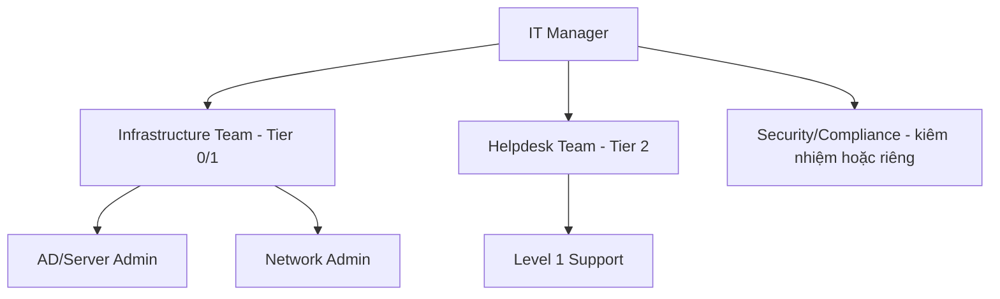

# IT Organization

Liên quan: [[00. Module Overview]] · [[02. IT Roles]]

## 1. Mục đích
Mô tả cơ cấu tổ chức phòng IT, làm cơ sở thiết kế Tier Administration và Delegation trong AD.

## Sơ đồ tổ chức (mẫu — điền theo thực tế doanh nghiệp)

## Checklist
- [ ] Sơ đồ tổ chức khớp với thực tế nhân sự hiện tại
- [ ] Mỗi vị trí có mô tả vai trò tương ứng tại [[02. IT Roles]]

## Tags
#governance #organization
