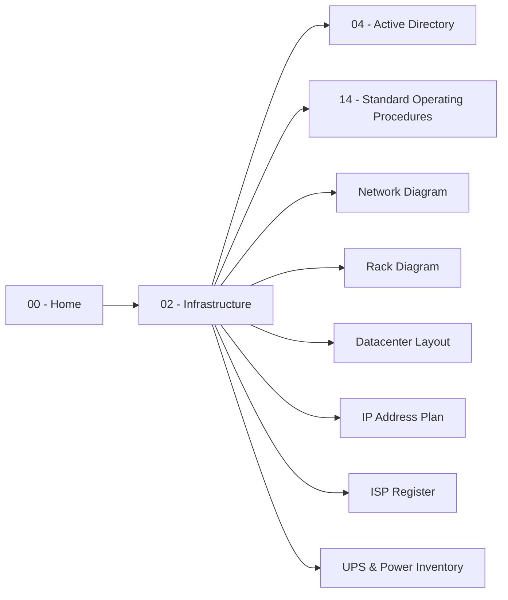

# Module 02 — Infrastructure

Liên quan: [[04 SOP/Enterprise IT Operations Manual/00 - Home/00. Home|00 - Home]]

## Mục đích module
Sơ đồ toàn bộ hạ tầng vật lý và logic: Datacenter, Rack, UPS, Firewall, Switch, Server, Storage, Internet, VPN, IP Plan, Subnet, VLAN, ISP.

## Danh sách tài liệu dự kiến

| # | Tài liệu | Trạng thái | Ghi chú |
|---|---|---|---|
| 1 | [[01. Network Diagram\|Network Diagram (Physical & Logical Topology)]] | 🟡 Draft | Sơ đồ vật lý + logic toàn hệ thống |
| 2 | [[02. Rack Diagram\|Rack Diagram]] | 🟡 Draft | Sơ đồ vị trí thiết bị trong rack |
| 3 | [[03. Datacenter - Server Room Layout\|Datacenter/Server Room Layout]] | 🟡 Draft | Mặt bằng phòng server |
| 4 | [[04. IP Address Plan\|IP Address Plan]] | 🟡 Draft | Toàn bộ subnet/VLAN |
| 5 | [[05. ISP & Internet Circuit Register\|ISP & Internet Circuit Register]] | 🟡 Draft | Đường truyền Internet/ISP |
| 6 | [[06. UPS & Power Inventory\|UPS & Power Inventory]] | 🟡 Draft | Kiểm kê UPS & nguồn điện |

> Cập nhật cột **Trạng thái** khi tài liệu hoàn thiện: 🔴 Chưa bắt đầu · 🟡 Draft · 🟢 Hoàn thiện.

## Liên kết đã có
- Danh sách IP tĩnh cốt lõi: [[../04 - Active Directory/Tiered Administration Project/../../04 - Active Directory/../14 - Standard Operating Procedures/00. Module Overview|14 - Standard Operating Procedures]] *(sẽ được xây đầy đủ khi module này được yêu cầu triển khai chi tiết)*

## Sơ đồ liên kết module

## Việc cần làm để hoàn thiện module
- [ ] Vẽ Network Diagram physical + logical
- [ ] Vẽ Rack Diagram cho từng rack
- [ ] Cập nhật mặt bằng phòng server
- [ ] Điền đầy đủ bảng IP Address Plan theo VLAN
- [ ] Điền thông tin hợp đồng/đường truyền ISP
- [ ] Kiểm kê UPS và tải điện thực tế
- [ ] Liên kết chéo với Module 04 - Active Directory và Module 14 - SOP khi các module đó được triển khai
