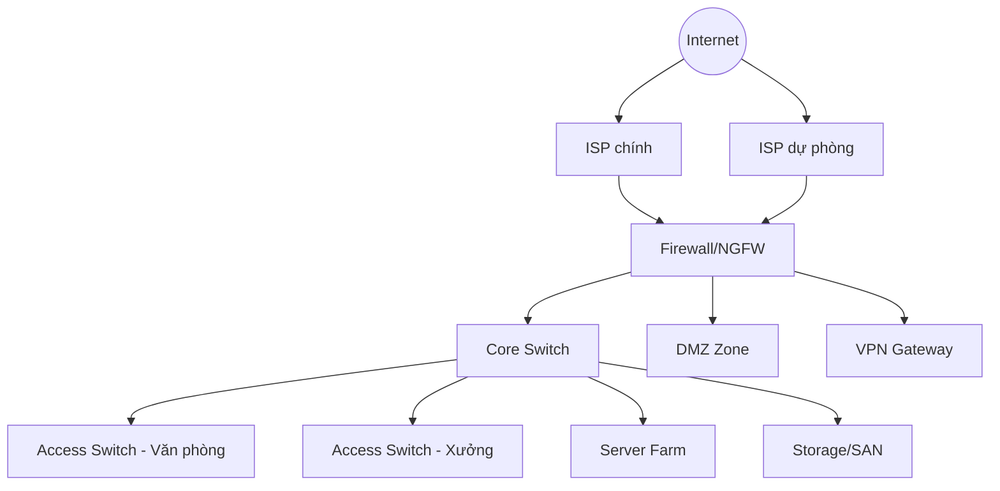

# 01. Network Diagram — Physical & Logical Topology

Liên quan: [[00. Module Overview]]

## Mục đích
Thể hiện toàn bộ sơ đồ kết nối mạng — cả về mặt **vật lý** (thiết bị, cáp, cổng) và **logic** (VLAN, subnet, routing, firewall zone).

---

## 1. Physical Topology (Sơ đồ vật lý)
> Dán ảnh sơ đồ (draw.io/Visio export .png/.svg) vào đây, hoặc nhúng qua `![[ten-file-so-do.png]]`.

- [ ] Datacenter chính
- [ ] Site/chi nhánh (nếu có)
- [ ] Kết nối WAN giữa các site
- [ ] Vị trí Firewall / Core Switch / Access Switch / Server / Storage

```
![[Network - Physical Topology.png]]
```

## 2. Logical Topology (Sơ đồ logic)
> Sơ đồ luồng dữ liệu theo VLAN/Subnet/Zone (DMZ, LAN, Server Farm, Guest...).

```
![[Network - Logical Topology.png]]
```

### Sơ đồ nhanh (mermaid — cập nhật khi có thiết bị thật)


---

## 3. Danh sách thiết bị chính
| Thiết bị | Model | IP quản lý | Vị trí | Ghi chú |
|---|---|---|---|---|
| Core Switch | | | | |
| Firewall/NGFW | | | | |
| Access Switch | | | | |
| VPN Gateway | | | | |

---

## 4. Lịch sử thay đổi
| Ngày | Nội dung thay đổi | Người thực hiện |
|---|---|---|
| | | |

---
🔗 Xem thêm: [[02. Rack Diagram]] · [[04. IP Address Plan]] · [[05. ISP & Internet Circuit Register]]
