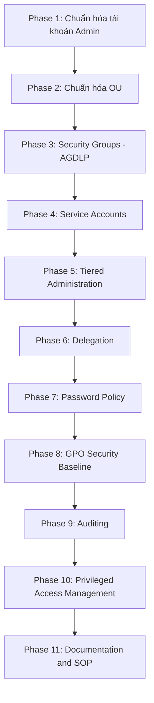

# Enterprise Active Directory Security Roadmap

Liên quan: [[../00. Module Overview]] · [[../../03 - Identity & Access Management/00. Module Overview]] · [[../../01 - Governance/06. Security Policy]]

## Bối cảnh
- Domain `Company.local` vừa nâng cấp Domain Controller từ **Windows Server 2008 R2 → 2012 R2**.
- Domain/Forest Functional Level cần nâng lên **Windows Server 2012 R2** để dùng được các tính năng mới (gMSA nâng cao, Fine-Grained Password Policy qua GUI, KDS Root Key cho LAPS/gMSA...).
- Mục tiêu: chuẩn hóa toàn bộ mô hình quản trị theo **Tiered Administration + Least Privilege + RBAC + Auditing** — mô hình Microsoft áp dụng cho Enterprise.

## Sơ đồ tổng thể 11 Phase



## Bảng theo dõi tiến độ

| Phase | Nội dung | Tài liệu | Trạng thái |
|---|---|---|---|
| 1 | Chuẩn hóa tài khoản Admin | [[01. Phase 1 - Admin Account Standardization]] | ☐ Chưa bắt đầu |
| 2 | Chuẩn hóa OU | [[02. Phase 2 - OU Design]] | ☐ Chưa bắt đầu |
| 3 | Security Groups (AGDLP) | [[03. Phase 3 - Security Groups (AGDLP)]] | ☐ Chưa bắt đầu |
| 4 | Service Accounts | [[04. Phase 4 - Service Accounts]] | ☐ Chưa bắt đầu |
| 5 | Tiered Administration | [[05. Phase 5 - Tiered Administration]] | ☐ Chưa bắt đầu |
| 6 | Delegation | [[06. Phase 6 - Delegation]] | ☐ Chưa bắt đầu |
| 7 | Password Policy | [[07. Phase 7 - Password Policy]] | ☐ Chưa bắt đầu |
| 8 | GPO Security Baseline | [[08. Phase 8 - GPO Security Baseline]] | ☐ Chưa bắt đầu |
| 9 | Auditing | [[09. Phase 9 - Auditing]] | ☐ Chưa bắt đầu |
| 10 | Privileged Access Management | [[10. Phase 10 - Privileged Access Management]] | ☐ Chưa bắt đầu |
| 11 | Documentation & SOP | [[11. Phase 11 - Documentation and SOP]] | ☐ Chưa bắt đầu |

## Nguyên tắc bắt buộc xuyên suốt dự án
1. **Không triển khai nhảy cóc** — mỗi Phase phụ thuộc Phase trước (OU phải có trước khi Delegate; Group phải có trước khi Tiered Admin phân nhóm theo Tier).
2. **Luôn có ADM-BreakGlass** trước khi disable Administrator mặc định — không được để domain rơi vào trạng thái không ai đăng nhập được.
3. **Test trên OU/nhóm nhỏ trước khi áp dụng toàn domain** — đặc biệt với GPO Baseline (Phase 8), rủi ro khóa nhầm quyền truy cập diện rộng rất cao.
4. **Domain Functional Level 2012 R2**: xác nhận đã nâng trước khi triển khai Phase 4 (gMSA) và Phase 10 (một số tính năng PAM nâng cao yêu cầu functional level tối thiểu).
5. Mọi thay đổi đều ghi vào [[11. Phase 11 - Documentation and SOP#Change Log|Change Log]].

## Kiểm tra Domain Functional Level trước khi bắt đầu
```powershell
Get-ADDomain | Select-Object Name, DomainMode
Get-ADForest | Select-Object Name, ForestMode

# Nếu chưa ở mức 2012 R2 (yêu cầu toàn bộ DC đã lên 2012 R2):
Set-ADDomainMode -Identity Company.local -DomainMode Windows2012R2Domain
Set-ADForestMode -Identity Company.local -ForestMode Windows2012R2Forest
```

**Bắt đầu:** [[01. Phase 1 - Admin Account Standardization]]
