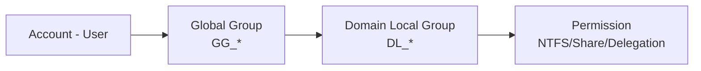

# Phase 3 — Chuẩn hóa Security Group (mô hình AGDLP)

Liên quan: [[02. Phase 2 - OU Design]] · [[06. Phase 6 - Delegation]] · [[../../03 - Identity & Access Management/02. RBAC Design]]

## 1. Mục đích
Loại bỏ hoàn toàn việc cấp quyền trực tiếp cho từng User — chuyển sang mô hình **AGDLP** (Account → Global Group → Domain Local Group → Permission), nền tảng của RBAC trong AD. Đây là bước bắt buộc trước khi Delegation (Phase 6) vì Delegation chuẩn luôn nhắm tới Group, không nhắm tới User cá nhân.

## 2. Phạm vi áp dụng
Toàn bộ phân quyền truy cập tài nguyên (File Server, ứng dụng, quyền quản trị AD) trong domain.

## 3. Điều kiện tiên quyết
- [ ] Đã hoàn tất Phase 2 (có OU `Groups` để chứa toàn bộ Security Group).
- [ ] Đã kiểm kê danh sách quyền hiện đang cấp trực tiếp cho User (nếu có) để lên kế hoạch chuyển đổi.

## 4. Quy trình thực hiện

### Bước 1 — Hiểu mô hình AGDLP

- **Global Group (GG_*):** gom user theo vai trò/phòng ban (ví dụ `GG_IT_Helpdesk`).
- **Domain Local Group (DL_*):** gắn trực tiếp vào Permission cụ thể (ví dụ `DL_FileServer_HR_ReadWrite`).
- User luôn vào Global Group; Global Group là member của Domain Local Group; Domain Local Group được cấp Permission — **không bao giờ** cấp Permission thẳng cho Global Group hay User.

### Bước 2 — Tạo nhóm chuẩn cho AD/IT Admin
```powershell
New-ADGroup -Name "GG_IT_Helpdesk" -GroupScope Global -GroupCategory Security -Path "OU=Groups,DC=company,DC=local"
New-ADGroup -Name "GG_IT_Server" -GroupScope Global -GroupCategory Security -Path "OU=Groups,DC=company,DC=local"
New-ADGroup -Name "GG_IT_DomainAdmin" -GroupScope Global -GroupCategory Security -Path "OU=Groups,DC=company,DC=local"
New-ADGroup -Name "GG_HR" -GroupScope Global -GroupCategory Security -Path "OU=Groups,DC=company,DC=local"
New-ADGroup -Name "GG_Finance" -GroupScope Global -GroupCategory Security -Path "OU=Groups,DC=company,DC=local"

# Domain Local Group tương ứng để gắn Permission
New-ADGroup -Name "DL_FileServer_HR_ReadWrite" -GroupScope DomainLocal -GroupCategory Security -Path "OU=Groups,DC=company,DC=local"
New-ADGroup -Name "DL_AD_Helpdesk_ResetPassword" -GroupScope DomainLocal -GroupCategory Security -Path "OU=Groups,DC=company,DC=local"
```

### Bước 3 — Gán thành viên theo AGDLP
```powershell
# User vào Global Group
Add-ADGroupMember -Identity "GG_IT_Helpdesk" -Members "adm.nva"

# Global Group vào Domain Local Group
Add-ADGroupMember -Identity "DL_AD_Helpdesk_ResetPassword" -Members "GG_IT_Helpdesk"

# Domain Local Group được cấp Permission (ví dụ NTFS)
# Thực hiện qua icacls hoặc Delegation Wizard, KHÔNG cấp trực tiếp cho GG_IT_Helpdesk hay adm.nva
```

### Bước 4 — Rà soát và loại bỏ phân quyền trực tiếp cho User hiện có
```powershell
# Ví dụ kiểm tra NTFS permission có entry là User cá nhân (không phải Group) để chuyển đổi dần
icacls "D:\Shares\HR" | findstr /i "nva"
```
Với mỗi trường hợp phát hiện, tạo/chọn Domain Local Group phù hợp, gán quyền cho Group, gỡ quyền trực tiếp của User.

## 5. Kiểm tra sau triển khai
```powershell
Get-ADGroup -Filter 'Name -like "GG_*" -or Name -like "DL_*"' | Select Name, GroupScope
Get-ADGroupMember -Identity "GG_IT_Helpdesk"
```
- [ ] Không còn Permission nào cấp trực tiếp cho User (đã rà soát toàn bộ share/ACL quan trọng).
- [ ] Naming convention `GG_*`/`DL_*` được tuân thủ nhất quán — xem thêm [[../../01 - Governance/04. Naming Convention]].

## 6. Rollback (nếu có)
Nếu phát hiện Group mới gây thiếu quyền so với trước (user không truy cập được tài nguyên như cũ), tạm thời cấp lại quyền trực tiếp cho user đó **kèm ticket theo dõi**, đồng thời điều tra thiếu sót trong thiết kế Group để bổ sung đúng, không để việc cấp tạm trở thành vĩnh viễn.

## 7. Kiểm tra bảo mật
- [ ] Nhóm `GG_IT_DomainAdmin` chỉ chứa các tài khoản Tier0 Admin đã xác định ở Phase 1/5 — rà soát định kỳ hàng tháng (liên kết [[10. Phase 10 - Privileged Access Management]]).
- [ ] Domain Local Group cấp quyền nhạy cảm (ví dụ Reset Password AD) phải review khi Delegate ở Phase 6.

## 8. Troubleshooting
| Sự cố | Nguyên nhân | Cách xử lý |
|---|---|---|
| User vào Global Group nhưng vẫn không có quyền truy cập | Global Group chưa được thêm vào đúng Domain Local Group | Kiểm tra lại chuỗi AGDLP đầy đủ 3 bước |
| Quyền có tác dụng ngay khi cấp trực tiếp nhưng qua Group thì phải đợi | Bình thường — cần đăng xuất/đăng nhập lại hoặc chờ Kerberos ticket refresh (tối đa vài giờ) để token nhóm cập nhật | Yêu cầu user logoff/logon lại để nhận token mới ngay |

## 9. Nhật ký thay đổi
| Ngày | Người thực hiện | Nội dung |
|---|---|---|
| | | Khởi tạo Phase 3 |

## 10. Tài liệu tham khảo
- Microsoft Learn: AGDLP/AGUDLP group strategy
- [[../../03 - Identity & Access Management/02. RBAC Design]]

## Tags
#active-directory #agdlp #rbac #security-groups

---
**Tiếp theo:** [[04. Phase 4 - Service Accounts]]
