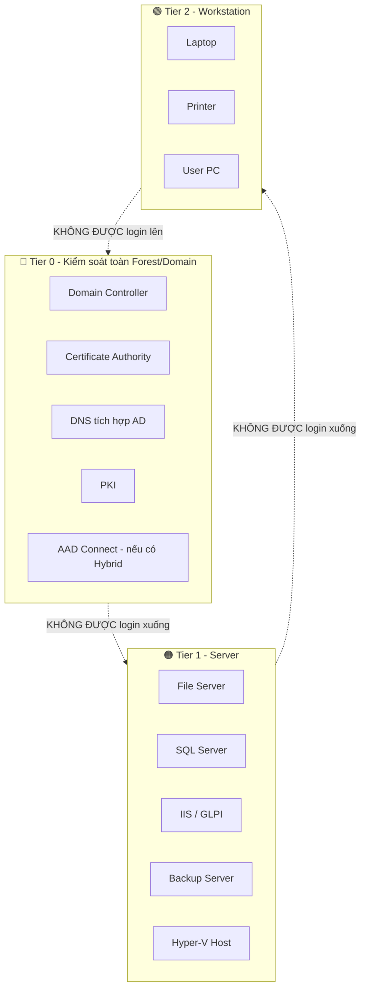

# Phase 5 — Tiered Administration (Phần quan trọng nhất)

Liên quan: [[04. Phase 4 - Service Accounts]] · [[06. Phase 6 - Delegation]] · [[08. Phase 8 - GPO Security Baseline]] · [[10. Phase 10 - Privileged Access Management]]

## 1. Mục đích
Ngăn chặn kịch bản tấn công phổ biến nhất trong AD: **credential theft leo thang** — kẻ tấn công chiếm quyền 1 máy trạm thường (Tier 2), đánh cắp cache credential của admin từng RDP vào đó, rồi dùng credential này leo thang lên Server (Tier 1) và cuối cùng lên Domain Controller (Tier 0). Mô hình Tiered Administration chặn đường leo thang này bằng cách **không cho phép credential của Tier cao hơn được dùng để đăng nhập vào Tier thấp hơn**.

## 2. Phạm vi áp dụng
Toàn bộ tài khoản Admin, Server, Workstation trong domain.

## 3. Điều kiện tiên quyết
- [ ] Đã hoàn tất Phase 2 (OU Tier0-Admins/Tier1-Admins/Tier2-Admins, Tier0-DC/Tier1-AppServers đã tồn tại).
- [ ] Đã hoàn tất Phase 3 (Security Group theo mô hình AGDLP).
- [ ] Domain Functional Level 2012 R2 đã xác nhận.

## 4. Quy trình thực hiện

### Bước 1 — Định nghĩa 3 Tier cho quy mô doanh nghiệp vừa (52 server, 420 workstation)



**Quy tắc cốt lõi (bắt buộc tuân thủ tuyệt đối):**

| Tài khoản | Được đăng nhập vào | Không được đăng nhập vào |
|---|---|---|
| `adm0.*` (Tier 0 Admin) | Chỉ Domain Controller, CA, PKI | Server (Tier 1), Workstation (Tier 2) |
| `adm1.*` (Tier 1 Admin) | Server: GLPI, SQL, IIS, Backup, Hyper-V | Domain Controller (Tier 0), Workstation (Tier 2) |
| `adm2.*` (Tier 2 Admin) | Workstation/PC người dùng | Domain Controller (Tier 0), Server (Tier 1) |

### Bước 2 — Tạo tài khoản Admin theo Tier
```powershell
# Tier 0 - chỉ dành cho quản trị Domain Controller
New-ADUser -Name "ADM0 Nguyen Van A" -SamAccountName "adm0.nva" `
  -Path "OU=Tier0-Admins,OU=Admin Accounts,DC=company,DC=local" `
  -Enabled $true -AccountPassword (Read-Host -AsSecureString "Password")

# Tier 1 - dành cho quản trị Server (GLPI, SQL, IIS, Backup)
New-ADUser -Name "ADM1 Nguyen Van A" -SamAccountName "adm1.nva" `
  -Path "OU=Tier1-Admins,OU=Admin Accounts,DC=company,DC=local" `
  -Enabled $true -AccountPassword (Read-Host -AsSecureString "Password")

# Tier 2 - dành cho hỗ trợ Workstation người dùng
New-ADUser -Name "ADM2 Nguyen Van A" -SamAccountName "adm2.nva" `
  -Path "OU=Tier2-Admins,OU=Admin Accounts,DC=company,DC=local" `
  -Enabled $true -AccountPassword (Read-Host -AsSecureString "Password")
```
> Một kỹ sư có thể sở hữu cả 3 tài khoản nếu công việc yêu cầu (ví dụ kỹ sư hạ tầng chính), nhưng **mỗi tài khoản chỉ dùng đúng phạm vi Tier của nó** — không dùng `adm0.nva` để RDP vào Server GLPI.

### Bước 3 — Áp đặt kỹ thuật bằng GPO "Deny logon" chéo Tier (bắt buộc, không chỉ dựa vào ý thức con người)
Tạo 3 GPO riêng, link vào đúng OU Server/Workstation tương ứng:

**GPO "Tier0-DC-DenyLogon"** (link vào `OU=Tier0-DC`):
`Computer Configuration > Security Settings > Local Policies > User Rights Assignment`
- `Deny log on locally` = nhóm `GG_Tier1-Admins`, `GG_Tier2-Admins`
- `Deny log on through Remote Desktop Services` = nhóm `GG_Tier1-Admins`, `GG_Tier2-Admins`

**GPO "Tier1-Server-DenyLogon"** (link vào `OU=Tier1-AppServers`):
- `Deny log on locally` = nhóm `GG_Tier0-Admins`, `GG_Tier2-Admins`
- `Deny log on through Remote Desktop Services` = nhóm `GG_Tier2-Admins`

**GPO "Tier2-Workstation-DenyLogon"** (link vào `OU=Workstations`):
- `Deny log on locally` = nhóm `GG_Tier0-Admins`, `GG_Tier1-Admins`
- `Deny log on through Remote Desktop Services` = nhóm `GG_Tier0-Admins`, `GG_Tier1-Admins`

```powershell
# Tạo nhóm tương ứng từng Tier trước khi gán vào GPO
New-ADGroup -Name "GG_Tier0-Admins" -GroupScope Global -Path "OU=Groups,DC=company,DC=local"
New-ADGroup -Name "GG_Tier1-Admins" -GroupScope Global -Path "OU=Groups,DC=company,DC=local"
New-ADGroup -Name "GG_Tier2-Admins" -GroupScope Global -Path "OU=Groups,DC=company,DC=local"

Add-ADGroupMember -Identity "GG_Tier0-Admins" -Members "adm0.nva"
Add-ADGroupMember -Identity "GG_Tier1-Admins" -Members "adm1.nva"
Add-ADGroupMember -Identity "GG_Tier2-Admins" -Members "adm2.nva"
```

## 5. Kiểm tra sau triển khai
**Test bắt buộc trước khi coi Phase 5 hoàn tất:**
- [ ] Thử RDP vào 1 server Tier 1 bằng tài khoản `adm0.*` → phải bị **từ chối**.
- [ ] Thử RDP vào Domain Controller bằng tài khoản `adm1.*` → phải bị **từ chối**.
- [ ] Thử đăng nhập vào Workstation bằng `adm0.*`/`adm1.*` → phải bị **từ chối**.
- [ ] Tài khoản đúng Tier vẫn đăng nhập bình thường vào đúng phạm vi của nó.

```powershell
gpresult /r /scope computer   # chạy trên từng loại máy để xác nhận đúng GPO đã áp dụng
```

## 6. Rollback (nếu có)
Nếu GPO Deny logon gây khóa nhầm cả tài khoản đúng Tier (lỗi cấu hình nhóm sai), gỡ tạm Link GPO khỏi OU bị ảnh hưởng:
```powershell
Set-GPLink -Name "Tier1-Server-DenyLogon" -Target "OU=Tier1-AppServers,DC=company,DC=local" -LinkEnabled No
```
Sửa lại cấu hình nhóm, test lại trên 1 server trước khi bật lại Link cho toàn OU.

## 7. Kiểm tra bảo mật
- [ ] Xác nhận **không có ngoại lệ** nào được thêm vào GPO Deny Logon (mọi ngoại lệ đều là lỗ hổng tiềm ẩn cho leo thang đặc quyền).
- [ ] Kết hợp với LAPS ([[../../03 - Identity & Access Management/08. LAPS Deployment]]) để mật khẩu Local Admin trên từng máy không dùng chung nhau — bổ trợ cho Tiered Admin (nếu 1 máy Tier 2 bị chiếm, kẻ tấn công không thể dùng Local Admin đó để di chuyển ngang sang máy Tier 2 khác).

## 8. Troubleshooting
| Sự cố | Nguyên nhân | Cách xử lý |
|---|---|---|
| Tài khoản đúng Tier vẫn bị từ chối đăng nhập | User chưa nằm đúng Global Group Tier tương ứng, hoặc GPO chưa refresh | `gpupdate /force`, kiểm tra `Get-ADGroupMember` |
| Sau khi áp GPO, không ai đăng nhập được vào Domain Controller kể cả Tier 0 | Cấu hình nhầm Deny logon áp luôn cho Tier0-Admins | Sửa ngay GPO qua console vật lý/Safe Mode nếu cần, xem lại đúng nhóm bị deny |

## 9. Nhật ký thay đổi
| Ngày | Người thực hiện | Nội dung |
|---|---|---|
| | | Khởi tạo Phase 5 |

## 10. Tài liệu tham khảo
- Microsoft Learn: Securing Privileged Access — Enterprise Access Model (Tier 0/1/2)
- [[08. Phase 8 - GPO Security Baseline]]
- [[10. Phase 10 - Privileged Access Management]]

## Tags
#active-directory #tiered-administration #tier0 #tier1 #tier2 #critical

---
**Tiếp theo:** [[06. Phase 6 - Delegation]]
