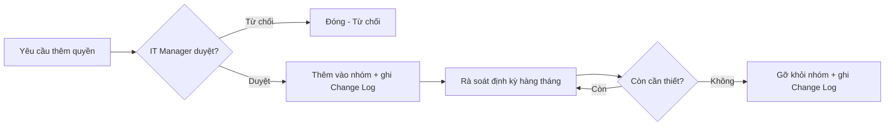

# Phase 10 — Quản lý đặc quyền (Privileged Access Management)

Liên quan: [[06. Phase 6 - Delegation]] · [[09. Phase 9 - Auditing]] · [[../../01 - Governance/03. Responsibility Matrix (RACI)]]

## 1. Mục đích
Duy trì lâu dài kỷ luật Least Privilege sau khi đã triển khai xong Phase 1-9 — Tiered Administration chỉ có giá trị nếu các nhóm đặc quyền được kiểm soát chặt chẽ và liên tục theo thời gian, không phải cấu hình 1 lần rồi bỏ quên.

## 2. Phạm vi áp dụng
Toàn bộ nhóm đặc quyền: Enterprise Admins, Domain Admins, Server Administrators, Helpdesk, Backup Operators, Print Operators.

## 3. Điều kiện tiên quyết
- [ ] Đã hoàn tất Phase 1-9.
- [ ] Đã có quy trình phê duyệt thay đổi (xem [[../../19 - Change Management/00. Module Overview]]).

## 4. Quy trình thực hiện

### Bước 1 — Nguyên tắc kiểm soát từng nhóm đặc quyền

| Nhóm | Phạm vi sử dụng | Số lượng thành viên khuyến nghị |
|---|---|---|
| **Enterprise Admins** | Chỉ dùng khi thay đổi ở mức toàn Forest (thêm domain mới, thay đổi Schema) | 0-1 tài khoản, thường để **trống**, chỉ thêm tạm thời khi cần rồi gỡ ngay sau khi xong việc |
| **Domain Admins** | Chỉ dành cho quản trị Domain Controller và dịch vụ Tier 0 | 2-3 tài khoản `adm0.*` tối đa |
| **Server Administrators** | Quản trị máy chủ ứng dụng Tier 1 (không phải nhóm AD chuẩn, thường tự tạo `GG_IT_Server` + Local Admin trên từng server qua GPO Restricted Groups) | Theo số kỹ sư Server Team |
| **Helpdesk** | Chỉ Reset Password, Unlock, Join Computer (đã Delegate ở Phase 6) | Toàn bộ Tier 2 support |
| **Backup Operators** | Chỉ quản trị backup/restore | Tài khoản `svc_backup` + kỹ sư phụ trách backup |
| **Print Operators** | Chỉ quản trị máy in (nếu còn dùng nhóm này — nhiều tổ chức hiện đại đã bỏ, quản lý qua Print Server riêng) | Hạn chế tối đa, cân nhắc loại bỏ nếu không cần thiết |

### Bước 2 — Thiết lập quy trình "Just-In-Time" cho Enterprise/Domain Admins (giảm thời gian có đặc quyền)
```powershell
# Thêm tạm thời khi cần
Add-ADGroupMember -Identity "Domain Admins" -Members "adm0.nva"

# Bắt buộc gỡ ngay sau khi hoàn tất công việc (không để "quên gỡ")
Remove-ADGroupMember -Identity "Domain Admins" -Members "adm0.nva" -Confirm:$false
```
> Với tổ chức có ngân sách, cân nhắc triển khai **Microsoft PAM (Privileged Access Management) / Just Enough Administration (JEA)** để tự động hóa việc này thay vì thao tác tay — nằm ngoài phạm vi Windows Server 2012 R2 gốc, cần đánh giá riêng.

### Bước 3 — Rà soát định kỳ thành viên nhóm đặc quyền
```powershell
# Script rà soát hàng tháng - lưu kết quả để đối chiếu tháng trước/tháng sau
$groups = @("Enterprise Admins","Domain Admins","Schema Admins","GG_IT_Server","GG_IT_Helpdesk","Backup Operators")
foreach ($g in $groups) {
    Write-Output "=== $g ==="
    Get-ADGroupMember -Identity $g | Select Name, SamAccountName
}
```
Xuất kết quả, so sánh với báo cáo tháng trước — mọi thành viên mới xuất hiện phải có lý do/ticket phê duyệt tương ứng đối chiếu được.

### Bước 4 — Quy trình phê duyệt thêm/xóa thành viên nhóm đặc quyền


## 5. Kiểm tra sau triển khai
- [ ] `Enterprise Admins` trống hoặc chỉ có 1 tài khoản với lý do rõ ràng.
- [ ] `Domain Admins` không vượt quá 3 tài khoản.
- [ ] Mọi thành viên nhóm đặc quyền đều đối chiếu được với ticket/change request phê duyệt.

## 6. Rollback (nếu có)
Không áp dụng theo nghĩa kỹ thuật — đây là quy trình vận hành liên tục. "Rollback" ở đây là gỡ ngay thành viên được phát hiện không còn lý do chính đáng khi rà soát.

## 7. Kiểm tra bảo mật
- [ ] Đặt cảnh báo tự động (qua Phase 9 Auditing) khi có thay đổi thành viên nhóm đặc quyền — không chờ tới chu kỳ rà soát hàng tháng mới phát hiện.
- [ ] Không có tài khoản Service Account nào nằm trong nhóm Domain Admins/Enterprise Admins (đối chiếu lại Phase 4).

## 8. Troubleshooting
| Sự cố | Nguyên nhân | Cách xử lý |
|---|---|---|
| Phát hiện thành viên lạ trong Domain Admins khi rà soát | Có thể do quên gỡ sau khi xử lý tạm, hoặc dấu hiệu bị xâm nhập | Gỡ ngay, điều tra qua log Phase 9 xem thời điểm/người thêm vào, nếu nghi ngờ tấn công kích hoạt quy trình tại [[../../15 - Incident Response/00. Module Overview]] |

## 9. Nhật ký thay đổi
| Ngày | Người thực hiện | Nội dung |
|---|---|---|
| | | Khởi tạo Phase 10 |

## 10. Tài liệu tham khảo
- Microsoft Learn: Privileged Access Management for Active Directory
- [[../../01 - Governance/03. Responsibility Matrix (RACI)]]

## Tags
#active-directory #pam #privileged-access #least-privilege

---
**Tiếp theo:** [[11. Phase 11 - Documentation and SOP]]
