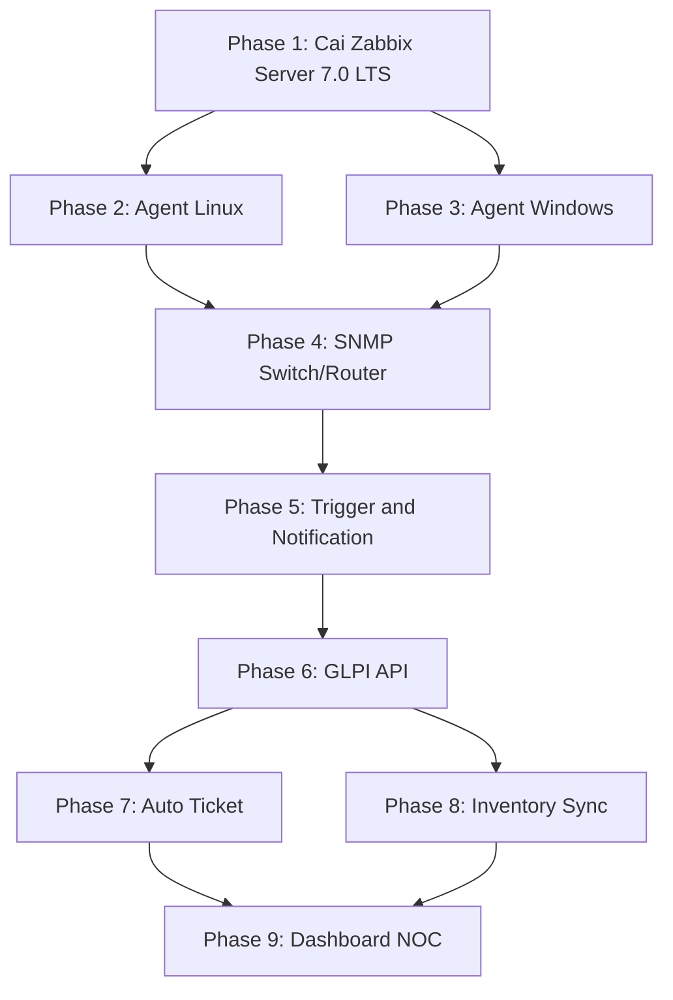
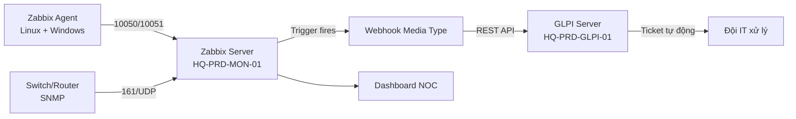

# Zabbix + GLPI Integration Roadmap

Liên quan: [[../00. Module Overview]] · [[../../13 - ITSM (GLPI)/00. Module Overview]] · [[../../01 - Governance/04. Naming Convention]]

## Ghi chú quan trọng về version (đọc trước khi bắt đầu)
Anh đề xuất "Zabbix 7.4 LTS" — thực tế **7.4 không phải bản LTS**, mà là bản Standard (full support chỉ 6 tháng, đã EOL 30/09/2026). Bản LTS chính thức hiện tại là **Zabbix 7.0 LTS** (hỗ trợ tới 06/2029, gấp nhiều lần thời gian hỗ trợ của 7.4). Với dự án hạ tầng giám sát dài hạn, toàn bộ tài liệu dưới đây dùng **7.0 LTS**. Nếu anh vẫn muốn dùng 7.4 vì cần tính năng mới cụ thể, các bước cài đặt gần như giống hệt — chỉ đổi số version trong lệnh cài.

## Sơ đồ tổng thể 9 Phase

## Bảng theo dõi tiến độ

| Phase | Nội dung | Tài liệu | Trạng thái |
|---|---|---|---|
| 1 | Cài Zabbix Server 7.0 LTS | [[01. Phase 1 - Cai Zabbix Server]] | 🔜 |
| 2 | Cài Agent Linux | [[02. Phase 2 - Agent Linux]] | 🔜 |
| 3 | Cài Agent Windows | [[03. Phase 3 - Agent Windows]] | 🔜 |
| 4 | Giám sát SNMP Switch/Router | [[04. Phase 4 - SNMP Switch Router]] | 🔜 |
| 5 | Trigger & Notification | [[05. Phase 5 - Trigger and Notification]] | 🔜 |
| 6 | GLPI API | [[06. Phase 6 - GLPI API]] | 🔜 |
| 7 | Auto Ticket | [[07. Phase 7 - Auto Ticket]] | 🔜 |
| 8 | Inventory Sync | [[08. Phase 8 - Inventory Sync]] | 🔜 |
| 9 | Dashboard NOC | [[09. Phase 9 - Dashboard NOC]] | 🔜 |

## Kiến trúc tổng thể

## Nguyên tắc thiết kế
1. **Zabbix = nguồn dữ liệu real-time** (CPU/RAM/Disk/Service Up-Down/SNMP), **GLPI = nguồn dữ liệu tài sản + ticket** (CMDB, vòng đời thiết bị, SLA) — không để 2 hệ thống dẫm chân nhau, mỗi hệ thống giữ vai trò nó mạnh nhất.
2. **GLPI là nguồn chân lý cho danh sách tài sản (Single Source of Truth)** — Zabbix host được tạo/đồng bộ *từ* GLPI Asset, không nhập tay song song 2 nơi (xem Phase 8).
3. Đặt tên Zabbix Server theo đúng [[../../01 - Governance/04. Naming Convention]]: Role `MON` đã có sẵn trong bảng chuẩn → `HQ-PRD-MON-01`.
4. Mã hóa toàn bộ kết nối Agent-Server bằng **PSK (Pre-Shared Key)** — không truyền dữ liệu giám sát dạng cleartext qua mạng nội bộ.
5. Auto Ticket (Phase 7) chỉ tạo ticket cho **Trigger mức Warning trở lên** — tránh spam GLPI với hàng trăm ticket cho sự kiện không quan trọng.

**Bắt đầu:** [[01. Phase 1 - Cai Zabbix Server]]
