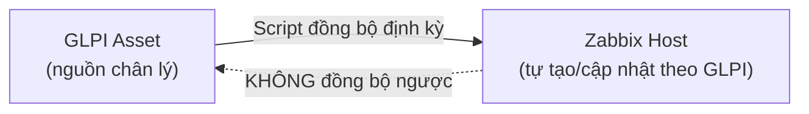

# Phase 8 — Inventory Sync (GLPI → Zabbix)

Liên quan: [[06. Phase 6 - GLPI API]] · [[00. Roadmap]] · [[../../06 - Asset Management/Computer|GLPI Deployment Manual - Asset Management]]

## 1. Mục đích
Tự động tạo/cập nhật Host trong Zabbix dựa trên danh sách Asset đã có sẵn trong GLPI — tránh nhập tay 2 lần (1 lần trong GLPI khi asset về, 1 lần trong Zabbix khi cần giám sát), và đảm bảo **GLPI luôn là nguồn chân lý duy nhất** cho câu hỏi "hệ thống có bao nhiêu thiết bị".

## 2. Phạm vi áp dụng
Computer, Network Equipment trong GLPI có trạng thái "Đang sử dụng" (In use).

## 3. Điều kiện tiên quyết
- [ ] Phase 6 hoàn tất (API GLPI hoạt động).
- [ ] Hostname trong GLPI Asset **khớp chính xác** với chuẩn đặt tên đã dùng khi tạo Zabbix Host ở Phase 2-4 (đây là điều kiện bắt buộc để script đối chiếu 2 hệ thống).

## 4. Quy trình thực hiện

### Bước 1 — Nguyên tắc chiều đồng bộ (quan trọng, quyết định kiến trúc)

- Chiều đồng bộ **1 chiều**: GLPI → Zabbix. Không đồng bộ ngược (Zabbix không tự tạo Asset trong GLPI) — tránh 2 hệ thống ghi đè lẫn nhau gây xung đột dữ liệu.
- Nhân viên IT khi nhập thiết bị mới **chỉ cần nhập 1 lần trong GLPI** theo đúng quy trình đã có (`13. SOP/Tiếp nhận máy mới`) — Zabbix Host sẽ tự xuất hiện sau lần chạy script kế tiếp.

### Bước 2 — Script đồng bộ (Python, chạy định kỳ qua cron trên Zabbix Server)
```python
#!/usr/bin/env python3
import requests, json

GLPI_URL = "https://glpi.company.local/apirest.php"
GLPI_USER_TOKEN = "USER_TOKEN_SVC_ZABBIX_GLPI"
GLPI_APP_TOKEN = "APP_TOKEN_TU_PHASE_6"
ZBX_URL = "http://HQ-PRD-MON-01/api_jsonrpc.php"
ZBX_TOKEN = "ZABBIX_API_TOKEN"

# 1. Lay danh sach Computer dang "Dang su dung" tu GLPI
headers = {"Authorization": f"user_token {GLPI_USER_TOKEN}", "App-Token": GLPI_APP_TOKEN}
session = requests.get(f"{GLPI_URL}/initSession", headers=headers).json()["session_token"]
headers["Session-Token"] = session

computers = requests.get(f"{GLPI_URL}/Computer?range=0-500", headers=headers).json()

# 2. Doi chieu va tao Host moi trong Zabbix neu chua co
for c in computers:
    if c.get("is_deleted") == 1:
        continue
    hostname = c["name"]   # phai khop chuan dat ten, vd HQ-PRD-SQL-01

    check = requests.post(ZBX_URL, json={
        "jsonrpc": "2.0", "method": "host.get",
        "params": {"filter": {"host": [hostname]}},
        "auth": ZBX_TOKEN, "id": 1
    }).json()

    if not check["result"]:
        # Host chua ton tai trong Zabbix -> tao moi
        requests.post(ZBX_URL, json={
            "jsonrpc": "2.0", "method": "host.create",
            "params": {
                "host": hostname,
                "interfaces": [{"type": 1, "main": 1, "useip": 1, "ip": c.get("ip_address", "0.0.0.0"), "dns": "", "port": "10050"}],
                "groups": [{"groupid": "5"}],   # ID host group "Synced from GLPI"
                "templates": [{"templateid": "10001"}]   # ID template mac dinh, vd "Windows by Zabbix agent"
            },
            "auth": ZBX_TOKEN, "id": 2
        })
        print(f"Da tao Zabbix host moi: {hostname}")
```

### Bước 3 — Lên lịch cron chạy định kỳ
```bash
chmod +x /opt/scripts/glpi-zabbix-sync.py
(crontab -l 2>/dev/null; echo "0 */6 * * * /usr/bin/python3 /opt/scripts/glpi-zabbix-sync.py >> /var/log/glpi-zabbix-sync.log 2>&1") | crontab -
```
Chạy mỗi 6 giờ — đủ nhanh để thiết bị mới xuất hiện trong Zabbix mà không cần đồng bộ real-time (tránh tải liên tục lên API).

### Bước 4 — Xử lý khi Asset bị thanh lý trong GLPI
Bổ sung logic: nếu Asset chuyển trạng thái "Đã thanh lý" trong GLPI, script tự động `host.update` set Zabbix Host về trạng thái **Disabled** (không xóa hẳn — giữ lịch sử dữ liệu giám sát cũ để tham khảo).

## 5. Kiểm tra sau triển khai
```bash
python3 /opt/scripts/glpi-zabbix-sync.py
```
- [ ] Chạy tay lần đầu, xác nhận số lượng Host mới tạo khớp với số Asset "Đang sử dụng" trong GLPI chưa có trong Zabbix.
- [ ] Thêm 1 Asset test mới trong GLPI, đợi cron chạy (hoặc chạy tay), xác nhận Host xuất hiện tự động trong Zabbix.

## 6. Rollback (nếu có)
```bash
crontab -l | grep -v "glpi-zabbix-sync.py" | crontab -
```
Gỡ cron nếu script gây lỗi hàng loạt, xử lý thủ công tạm thời trong lúc sửa script.

## 7. Kiểm tra bảo mật
- [ ] Script chạy bằng user riêng, không phải root — chỉ đủ quyền đọc GLPI API + ghi Zabbix API.
- [ ] Token trong script nên đưa vào file cấu hình riêng (không hardcode trực tiếp trong `.py` nếu đưa vào version control/Git).

## 8. Troubleshooting
| Sự cố | Nguyên nhân | Cách xử lý |
|---|---|---|
| Host tạo trùng nhiều lần | Hostname GLPI không khớp tuyệt đối với Zabbix (khác hoa/thường, khoảng trắng) | Rà soát lại chuẩn đặt tên đồng bộ giữa 2 hệ thống |
| Script chạy nhưng không tạo Host nào dù có Asset mới | Sai `groupid`/`templateid` (ID không tồn tại) | Lấy đúng ID thật qua `hostgroup.get`/`template.get` trước khi hardcode vào script |

## 9. Nhật ký thay đổi
| Ngày | Người thực hiện | Nội dung |
|---|---|---|

## 10. Tài liệu tham khảo
- Zabbix API Documentation: host.create
- GLPI Deployment Manual: `06. Asset Management/Computer`

## Tags
#monitoring #zabbix #glpi #inventory-sync #automation

---
**Tiếp theo:** [[09. Phase 9 - Dashboard NOC]]
