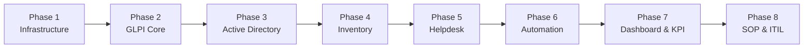

# 01. Project Overview

Liên quan: [[04 SOP/Enterprise IT Operations Manual/13 - ITSM (GLPI)/00. Home]] · [[02. Architecture]]

## Mục tiêu dự án
- Xây dựng hệ thống ITAM (IT Asset Management) + Helpdesk tập trung cho toàn bộ Quảng Việt.
- Chuẩn hóa quy trình tiếp nhận yêu cầu, xử lý sự cố theo hướng ITIL (Incident, Request, Problem, Change).
- Tự động hóa kiểm kê tài sản (không phụ thuộc Excel thủ công).
- Cung cấp KPI/báo cáo định kỳ cho Ban Giám đốc.
- Tài liệu hóa toàn bộ hệ thống để không phụ thuộc vào 1 cá nhân vận hành duy nhất (bus factor = 1 là rủi ro cần loại bỏ).

## Phạm vi (Scope)
| Trong phạm vi | Ngoài phạm vi (giai đoạn 1) |
|---|---|
| Quản lý Computer, Laptop, Network, Printer, Phone, License | Quản lý tài sản phi CNTT (bàn ghế, xe cộ...) |
| Helpdesk nội bộ nhân viên | Helpdesk cho khách hàng bên ngoài |
| Tích hợp Active Directory | Tích hợp ERP/kế toán (dự kiến giai đoạn 2) |
| Backup & DR cho GLPI | Backup cho toàn bộ hạ tầng công ty |

## Thông tin hệ thống (Server Facts)

| Thông số | Giá trị |
|---|---|
| Phiên bản GLPI | **11.0.8** |
| Server | GLPI Server |
| IP | `192.168.1.14` |
| Hệ điều hành | Debian 12 |
| Web server | Apache 2.4 |
| Ngôn ngữ | PHP 8.3 (yêu cầu tối thiểu GLPI 11: PHP ≥ 8.2) |
| Database | MariaDB 10.11 (yêu cầu tối thiểu GLPI 11: MariaDB ≥ 10.6 hoặc MySQL ≥ 8.0) |
| Cache | Redis |
| Xác thực | LDAP / Active Directory (`quangviet.local`) |
| Domain nội bộ | `glpi.quangviet.local` |
| Chi nhánh | Hà Nội (trụ sở chính), Hồ Chí Minh |
| Plugin bắt buộc cho Discovery/SNMP/VMware | **GLPI Inventory** (Marketplace) — không còn native từ GLPI 11 |

> **Về ngôn ngữ menu trong tài liệu này:** toàn bộ đường dẫn menu (`Setup > ...`, `Administration > ...`) được viết theo đúng tên tiếng Anh chính thức trong giao diện GLPI 11.0.8, để nhân viên IT tra cứu chính xác 1:1 với UI thật, không qua bản dịch tiếng Việt (vốn có thể lệch giữa các bản dịch cộng đồng).

## Roadmap 8 Phase

| Phase | Nội dung | Tài liệu liên quan |
|---|---|---|
| 1 | Debian, Apache, PHP, MariaDB, SSL, Backup | [[01 Debian\|Installation]] |
| 2 | Cài GLPI, Marketplace, Cron, Mail, Notification | [[07 GLPI]] |
| 3 | LDAP, Group, Profile, Entity, tự tạo user | [[03 LDAP Basic Config\|Authentication]] |
| 4 | GLPI Agent, GPO Deploy, Discovery, Rules, Assets | [[GLPI Agent]] |
| 5 | Ticket, SLA, Approval, Notification, Knowledge Base | [[SLA]] |
| 6 | Cron, LDAP Sync, Backup, Email, Reports | [[04 SOP/Enterprise IT Operations Manual/13 - ITSM (GLPI)/08. Automation/Cron]] |
| 7 | KPI, SQL Reports, Warranty, Asset Reports | [[04 SOP/Enterprise IT Operations Manual/13 - ITSM (GLPI)/12. Reports/KPI]] |
| 8 | Incident, Request, Change, Problem, Asset Lifecycle | [[Cấp laptop\|SOP]] |

## Checklist tổng
- [ ] Phase 1 hoàn tất và verify (`03. Installation`)
- [ ] Phase 2 hoàn tất và verify
- [ ] Phase 3 hoàn tất và verify
- [ ] Phase 4 hoàn tất và verify
- [ ] Phase 5 hoàn tất và verify
- [ ] Phase 6 hoàn tất và verify
- [ ] Phase 7 hoàn tất và verify
- [ ] Phase 8 hoàn tất và verify
- [ ] Go-live được Ban Giám đốc phê duyệt

## Ghi chú thực tế
- Không chuyển sang Phase kế tiếp khi Phase hiện tại chưa qua bước Verify — thứ tự phase được thiết kế có phụ thuộc (ví dụ: Inventory phụ thuộc Authentication đã ổn định để gán đúng Entity).
- Review lại Scope mỗi 6 tháng — công ty Quảng Việt dự kiến mở thêm chi nhánh Đà Nẵng, cần tính trước khả năng mở rộng entity/network.

**Tiếp theo:** [[02. Architecture]]
