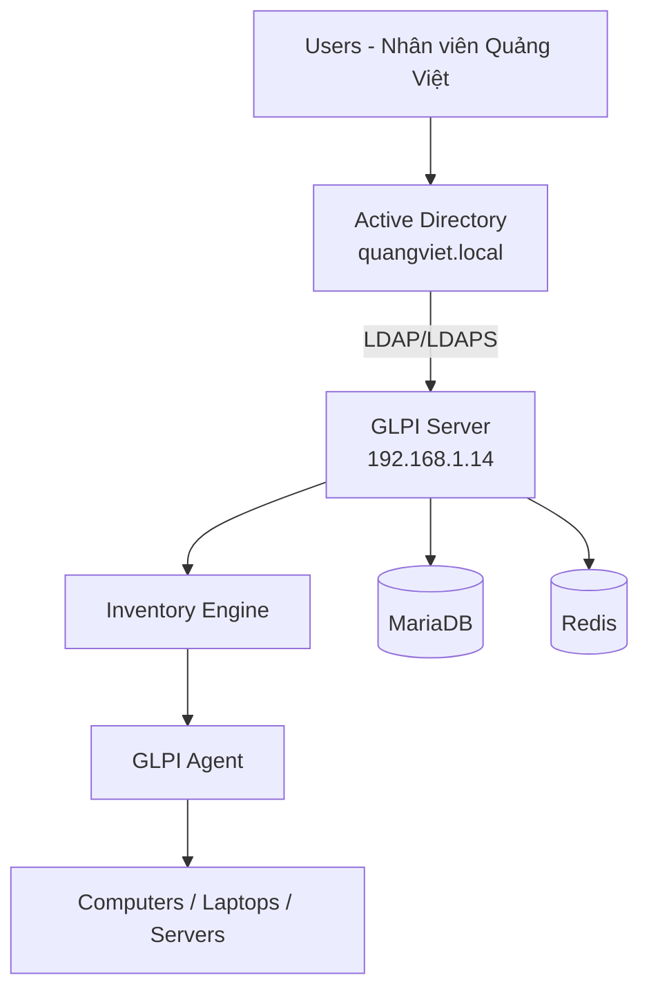
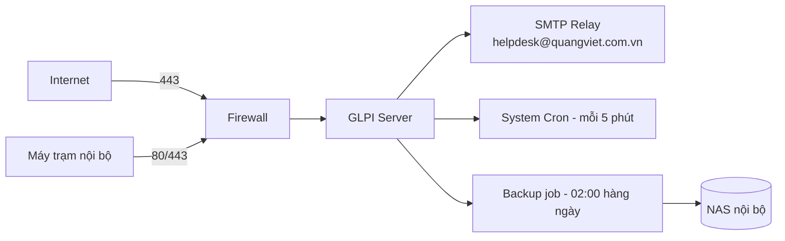

# 02. Architecture

Liên quan: [[01. Project Overview]] · [[04 SOP/Enterprise IT Operations Manual/13 - ITSM (GLPI)/10. Security/Firewall]] · [[04 SOP/Enterprise IT Operations Manual/13 - ITSM (GLPI)/08. Automation/Cron]] · [[Disaster Recovery]]

## Sơ đồ luồng xác thực & kiểm kê

## Sơ đồ hạ tầng phụ trợ

## Thành phần kiến trúc

| Lớp | Thành phần | Tài liệu |
|---|---|---|
| Hạ tầng | Debian, Apache, PHP, MariaDB, Redis, SSL | `03. Installation` |
| Xác thực | Active Directory, LDAP/LDAPS | `04. Authentication` |
| Thu thập dữ liệu | GLPI Agent, SNMP Discovery, VMware/Hyper-V connector | `05. Inventory` |
| Nghiệp vụ | Asset Management, Helpdesk (Ticket/SLA) | `06. Asset Management`, `07. Helpdesk` |
| Vận hành | Cron, LDAP Sync, Backup tự động | `08. Automation` |
| Giám sát | Log, tài nguyên hệ thống, chứng chỉ SSL | `09. Monitoring` |
| Bảo mật | HTTPS, Fail2ban, Firewall, 2FA, API | `10. Security` |
| Liên tục kinh doanh | Backup, Restore, DR | `11. Backup & Disaster Recovery` |

## Nguyên tắc thiết kế
- **Single source of truth:** Active Directory là nguồn xác thực & thông tin nhân sự duy nhất — GLPI không tạo tài khoản thủ công song song (trừ tài khoản dịch vụ/hệ thống).
- **Entity theo chi nhánh vật lý:** mọi tài sản/ticket được gán Entity đúng theo HN/HCM ngay từ lúc import, không sửa tay về sau.
- **Automation-first:** mọi tác vụ lặp lại (sync, backup, report) đều chạy qua Cron, hạn chế thao tác thủ công gây sai sót.
- **Defense in depth:** HTTPS bắt buộc, Fail2ban chặn brute-force, Firewall giới hạn truy cập, backup tách biệt khỏi server chính.

## Checklist kiến trúc trước khi go-live
- [ ] Sơ đồ mạng đã review với team Network
- [ ] Entity structure đã thống nhất với Ban Giám đốc (theo chi nhánh)
- [ ] Firewall rule đã áp dụng đúng theo [[04 SOP/Enterprise IT Operations Manual/13 - ITSM (GLPI)/10. Security/Firewall]]
- [ ] SMTP relay đã test gửi/nhận thành công
- [ ] Backup job đã chạy thử và verify restore

## Ghi chú thực tế
- Redis được thêm vào kiến trúc để tăng tốc session/cache cho GLPI khi số lượng người dùng đồng thời tăng — không bắt buộc ở quy mô nhỏ nhưng khuyến nghị ngay từ đầu để tránh phải re-architect sau này.
- Khi công ty mở chi nhánh mới (ví dụ Đà Nẵng), chỉ cần thêm 1 Entity con + rule gán theo dải IP/TAG mới, không cần thay đổi kiến trúc lõi.

**Tiếp theo:** [[01 Debian]]
