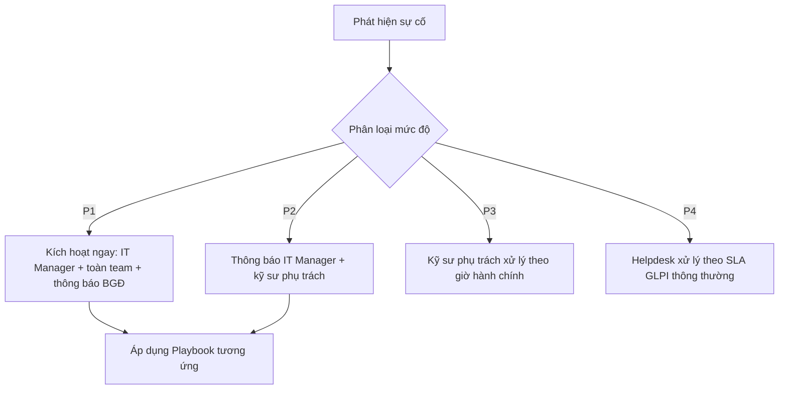

# Incident Severity & Escalation Matrix

Liên quan: [[00. Module Overview]] · [[../01 - Governance/03. Responsibility Matrix (RACI)]] · [[../04 - Active Directory/Tiered Administration Project/09. Phase 9 - Auditing]]

## 1. Mục đích
Khung phân loại mức độ nghiêm trọng dùng chung cho toàn bộ Playbook trong module này — đảm bảo phản ứng đúng tốc độ, đúng người, không xử lý sự cố nghiêm trọng theo tốc độ "từ từ" hoặc ngược lại báo động giả cho sự cố nhỏ.

## 2. Phạm vi áp dụng
Mọi sự cố bảo mật/vận hành ảnh hưởng hệ thống CNTT.

## 4. Bảng phân loại mức độ

| Mức | Tên gọi | Ví dụ | Thời gian phản ứng | Người được thông báo |
|---|---|---|---|---|
| **P1 — Critical** | Ảnh hưởng toàn domain/toàn công ty | Toàn bộ DC down, Ransomware lan rộng, Domain Admin bị xâm nhập | Ngay lập tức (< 15 phút) | IT Manager + toàn bộ Infrastructure Team + Ban Giám đốc (nếu > 2 giờ chưa khắc phục) |
| **P2 — High** | Ảnh hưởng 1 hệ thống quan trọng/1 chi nhánh | SQL Server down, 1 tài khoản Tier 1 Admin bị nghi ngờ xâm nhập, File Server không truy cập được | < 30 phút | IT Manager + kỹ sư phụ trách hệ thống liên quan |
| **P3 — Medium** | Ảnh hưởng 1 phòng ban/nhóm nhỏ | 1 Switch Access down, 1 máy in dùng chung lỗi | < 4 giờ (giờ hành chính) | Kỹ sư phụ trách trực tiếp |
| **P4 — Low** | Ảnh hưởng cá nhân, không khẩn cấp | 1 máy trạm lỗi, quên mật khẩu | Theo SLA GLPI thông thường | Helpdesk (Tier 2) |

## Sơ đồ leo thang (Escalation Flow)

## Danh sách Playbook theo loại sự cố
| Loại sự cố | Playbook |
|---|---|
| Tài khoản Admin nghi bị xâm nhập | [[02. Compromised Admin Account Response]] |
| Ransomware/mã độc lan rộng | [[03. Ransomware Response Playbook]] |
| Domain Controller down | [[04. AD Down - DC Failure Recovery Playbook]] |
| Rò rỉ dữ liệu | [[05. Data Leak Response Procedure]] |
| Mất điện/mất mạng diện rộng | [[06. Power Failure and Network Down Playbook]] |

## 5. Kiểm tra sau triển khai
- [ ] Toàn bộ kỹ sư IT thuộc danh sách trực đều biết bảng phân loại này và số điện thoại liên hệ khẩn cấp tương ứng.

## 9. Nhật ký thay đổi
| Ngày | Người thực hiện | Nội dung |
|---|---|---|

## 10. Tài liệu tham khảo
- NIST SP 800-61: Computer Security Incident Handling Guide

## Tags
#incident-response #severity #escalation
