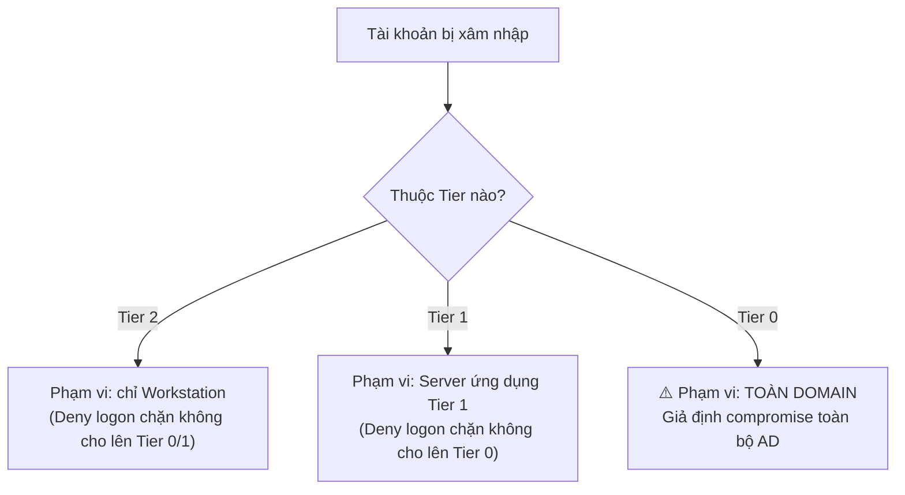

# Playbook: Compromised Admin Account Response

Liên quan: [[01. Incident Severity and Escalation Matrix]] · [[../04 - Active Directory/Tiered Administration Project/05. Phase 5 - Tiered Administration]] · [[../04 - Active Directory/Tiered Administration Project/09. Phase 9 - Auditing]] · [[../04 - Active Directory/Tiered Administration Project/10. Phase 10 - Privileged Access Management]]

## 1. Mục đích
Quy trình phản ứng khi phát hiện dấu hiệu 1 tài khoản Admin (`adm0.*`/`adm1.*`/`adm2.*`) bị xâm nhập — tận dụng trực tiếp mô hình Tiered Administration và Auditing đã triển khai để **giới hạn phạm vi thiệt hại (blast radius)** và điều tra nhanh.

## 2. Phạm vi áp dụng
Mọi tài khoản thuộc `GG_Tier0-Admins`, `GG_Tier1-Admins`, `GG_Tier2-Admins`, `GG_All-Tier-Admins`.

## 3. Điều kiện tiên quyết
- [ ] Phase 9 Auditing đã hoạt động (Event Forwarding, Advanced Audit Policy).
- [ ] Có quyền truy cập ADM-BreakGlass trong két sắt (kịch bản xấu nhất khi toàn bộ Admin khác nghi bị xâm nhập).

## 4. Quy trình thực hiện

### Dấu hiệu nhận biết (Detection Triggers)
| Dấu hiệu | Nguồn phát hiện |
|---|---|
| Đăng nhập ngoài giờ hành chính bất thường | Event ID 4624 qua WEF |
| Đăng nhập từ 2 vị trí địa lý cách xa nhau trong thời gian ngắn ("impossible travel") | So sánh IP nguồn trong log logon |
| Thành viên mới xuất hiện trong `Domain Admins`/`GG_Tier0-Admins` không rõ lý do | Event ID 4728/4732/4756 — xem [[../04 - Active Directory/Tiered Administration Project/09. Phase 9 - Auditing]] |
| Tài khoản `adm1.*`/`adm2.*` cố đăng nhập vào Domain Controller (bị GPO Deny chặn nhưng log lại nhiều lần thử) | Event ID 4625 (logon failure) tăng bất thường trên DC |
| AppLocker ghi nhận hàng loạt lần bị chặn mở Chrome/Outlook trên 1 tài khoản Admin trong thời gian ngắn | Log AppLocker — xem [[../08 - Security/01. AppLocker - Block Browser and Office on Admin Accounts]] (dấu hiệu tài khoản Admin đang bị dùng sai mục đích, có thể do người dùng hợp lệ **hoặc** kẻ tấn công) |

### Bước 1 — Containment tức thời (thực hiện trong vòng 15 phút đầu)
```powershell
# Disable ngay tài khoản nghi ngờ
Disable-ADAccount -Identity "adm1.nva"

# Buộc đăng xuất tất cả phiên đang hoạt động trên các server liên quan (chạy trên từng server nghi bị truy cập)
query user /server:HQ-PRD-SQL-01
logoff <SessionID> /server:HQ-PRD-SQL-01

# Reset mật khẩu ngay (không chờ điều tra xong mới reset)
$RandomPass = ConvertTo-SecureString ((New-Guid).Guid) -AsPlainText -Force
Set-ADAccountPassword -Identity "adm1.nva" -NewPassword $RandomPass -Reset
```

### Bước 2 — Xác định phạm vi ảnh hưởng dựa theo Tier (tận dụng lợi thế của mô hình đã triển khai)

- Nếu tài khoản bị xâm nhập là **Tier 2**: nhờ GPO Deny Logon (Phase 5), kẻ tấn công **không thể** dùng credential này để lên Server/DC — phạm vi điều tra giới hạn ở các Workstation tài khoản này từng đăng nhập.
- Nếu là **Tier 0**: phải giả định **toàn bộ domain có nguy cơ bị xâm nhập** — chuyển ngay sang quy trình nghiêm trọng nhất ở Bước 4.

### Bước 3 — Điều tra qua Auditing (Tier 1/2)
```powershell
# Xem toàn bộ máy tài khoản đã đăng nhập trong 30 ngày qua
Get-WinEvent -LogName "ForwardedEvents" -FilterXPath "*[System[EventID=4624]] and *[EventData[Data='adm1.nva']]" |
  Select TimeCreated, MachineName | Sort TimeCreated -Descending
```
- [ ] Rà soát toàn bộ hành động tài khoản thực hiện trên từng máy (thay đổi cấu hình, tạo user mới, truy cập file nhạy cảm).
- [ ] Kiểm tra có tài khoản/Group mới nào được tạo bởi chính tài khoản bị xâm nhập không (backdoor account).
- [ ] Sau khi điều tra xong và xác nhận containment đủ, **enable lại** tài khoản với mật khẩu mới, bắt buộc đổi lại 2FA nếu có.

### Bước 4 — Nếu tài khoản Tier 0 (Domain Admin) bị xâm nhập — quy trình nghiêm trọng nhất
1. **Kích hoạt P1** theo [[01. Incident Severity and Escalation Matrix]] ngay lập tức.
2. Disable toàn bộ tài khoản Tier 0 khác trong lúc điều tra (trừ ADM-BreakGlass dự phòng).
3. **Reset mật khẩu `krbtgt` 2 lần liên tiếp** (bắt buộc — đây là cách duy nhất vô hiệu hóa **Golden Ticket** nếu kẻ tấn công đã trích xuất được hash krbtgt):
   ```powershell
   Reset-ADServiceAccountPassword -Identity krbtgt
   # Đợi tối thiểu bằng thời gian sống vé Kerberos tối đa (mặc định 10 giờ) trước khi reset lần 2
   # để tránh gây gián đoạn xác thực domain trên diện rộng
   Reset-ADServiceAccountPassword -Identity krbtgt
   ```
   > ⚠️ Reset 2 lần quá gần nhau có thể gây gián đoạn đăng nhập tạm thời toàn domain (vé Kerberos cũ mất hiệu lực đột ngột) — cân nhắc đánh đổi giữa tốc độ xử lý và mức độ gián đoạn, quyết định bởi IT Manager.
4. Rà soát toàn bộ thành viên `Domain Admins`, `Enterprise Admins`, `Schema Admins` — gỡ mọi thành viên không xác định được lý do.
5. Kiểm tra toàn bộ GPO có bị chỉnh sửa trái phép không (đối chiếu [[../04 - Active Directory/05. GPO Documentation]]).
6. Cân nhắc thuê chuyên gia Forensics bên ngoài nếu nghi ngờ mức độ xâm nhập sâu (APT).

## 5. Kiểm tra sau triển khai
- [ ] Tài khoản bị xâm nhập đã disable/reset xong.
- [ ] Không còn phiên đăng nhập nào đang mở của tài khoản đó trên bất kỳ máy nào.
- [ ] Đã xác định và đóng được điểm xâm nhập ban đầu (root cause — ví dụ phishing, mật khẩu yếu, không phải chỉ xử lý triệu chứng).

## 6. Rollback (nếu có)
Không áp dụng — đây là quy trình containment, không có khái niệm rollback.

## 7. Kiểm tra bảo mật
- [ ] Sau sự cố, đánh giá lại: tài khoản có bật MFA chưa (nếu chưa, đây gần như chắc chắn là khuyến nghị bắt buộc ngay sau sự cố).
- [ ] Đánh giá lại thời gian tài khoản có quyền cao trước khi bị phát hiện — nếu quá dài, xem lại tần suất Auditing/rà soát tại [[../04 - Active Directory/Tiered Administration Project/10. Phase 10 - Privileged Access Management]].

## 8. Troubleshooting
| Sự cố | Nguyên nhân | Cách xử lý |
|---|---|---|
| Không chắc chắn tài khoản có thực sự bị xâm nhập hay chỉ là hành vi bất thường của chính chủ | Thiếu bằng chứng rõ ràng | Vẫn thực hiện containment tạm thời (Bước 1) trong lúc xác minh trực tiếp với người dùng qua kênh khác (điện thoại, gặp trực tiếp) — luôn ưu tiên an toàn hơn là chờ chắc chắn 100% |
| Reset krbtgt gây user không đăng nhập được hàng loạt | Reset 2 lần quá sát nhau, vé Kerberos cũ hết hiệu lực đột ngột | Đây là đánh đổi đã biết trước ở Bước 4 — thông báo người dùng đăng xuất/đăng nhập lại, không phải lỗi hệ thống |

## 9. Nhật ký thay đổi
| Ngày | Người thực hiện | Nội dung |
|---|---|---|

## 10. Tài liệu tham khảo
- Microsoft Learn: Kerberos Golden Ticket mitigation — krbtgt reset
- [[../04 - Active Directory/Tiered Administration Project/05. Phase 5 - Tiered Administration]]
- [[../04 - Active Directory/Tiered Administration Project/10. Phase 10 - Privileged Access Management]]

## Tags
#incident-response #compromised-account #golden-ticket #critical
