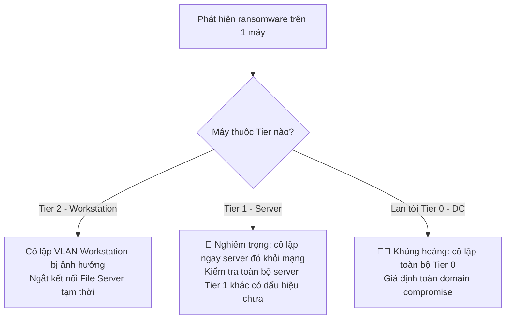

# Playbook: Ransomware Response

Liên quan: [[01. Incident Severity and Escalation Matrix]] · [[../04 - Active Directory/Tiered Administration Project/05. Phase 5 - Tiered Administration]] · [[../10 - Backup & Disaster Recovery/00. Module Overview]] · [[02. Compromised Admin Account Response]]

## 1. Mục đích
Quy trình phản ứng khi phát hiện mã độc mã hóa dữ liệu (ransomware) — ưu tiên **ngăn lan rộng** trước, khôi phục sau, tận dụng mô hình Tiered Administration để cô lập theo từng lớp.

## 2. Phạm vi áp dụng
Toàn bộ Server, Workstation trong domain.

## 3. Điều kiện tiên quyết
- [ ] Backup đã triển khai theo chiến lược 3-2-1 (xem [[../10 - Backup & Disaster Recovery/00. Module Overview]]), có bản sao **offline/air-gapped** không bị mã hóa cùng lúc.

## 4. Quy trình thực hiện

### Bước 1 — Cô lập ngay (KHÔNG tắt máy — xem lưu ý quan trọng)
```powershell
# Ngắt kết nối mạng của máy nghi nhiễm (KHÔNG shutdown/restart)
Disable-NetAdapter -Name "Ethernet" -Confirm:$false
```
> ⚠️ **KHÔNG tắt nguồn máy bị nhiễm** — một số ransomware tiếp tục mã hóa hoặc xóa dấu vết khi khởi động lại; đồng thời tắt máy làm mất dữ liệu RAM cần thiết cho điều tra forensics sau này (encryption key đôi khi còn trong RAM). Chỉ **ngắt mạng** (rút cáp/tắt WiFi/disable adapter) để dừng lan rộng, giữ nguyên máy đang chạy.

### Bước 2 — Xác định phạm vi lây lan, cô lập theo Tier

- Kiểm tra nhanh các máy khác cùng subnet/cùng share mạng với máy nhiễm — ransomware hiện đại lan qua SMB rất nhanh.
- Tạm khóa/disable các Share (File Server) đang bị ghi đè dữ liệu bất thường (dung lượng tăng đột biến, đuôi file lạ xuất hiện hàng loạt).

### Bước 3 — Kiểm tra xem có liên quan đến tài khoản Admin bị xâm nhập không
Đa số ransomware doanh nghiệp hiện đại lây lan qua credential bị đánh cắp (không chỉ qua file đính kèm email) — luôn kết hợp kiểm tra [[02. Compromised Admin Account Response]] song song.

### Bước 4 — Đánh giá tình trạng Backup TRƯỚC khi quyết định phục hồi
```powershell
# Kiểm tra tính toàn vẹn bản backup gần nhất — không phục hồi mù quáng
Test-Path "\\backup-server\GLPI\glpidb_latest.sql.gz"
```
- [ ] Xác nhận bản backup gần nhất **chưa bị mã hóa** (kiểm tra timestamp, thử mở/giải nén thử 1 file).
- [ ] Nếu ransomware đã lan tới cả Backup Server (rủi ro nghiêm trọng nếu Backup Server không tách biệt đủ) → chỉ còn bản offline/air-gapped/offsite dùng được — đây là lý do bắt buộc phải có tầng backup tách biệt hoàn toàn khỏi domain.

### Bước 5 — Quyết định: Trả tiền chuộc hay không
**Chính sách công ty: KHÔNG khuyến nghị trả tiền chuộc**, vì:
- Không đảm bảo nhận được khóa giải mã hoạt động đúng.
- Khuyến khích tiếp tục bị nhắm mục tiêu.
- Có thể vi phạm quy định pháp luật tùy đối tượng tấn công (danh sách trừng phạt quốc tế).
→ Ưu tiên khôi phục từ backup sạch.

### Bước 6 — Khôi phục theo thứ tự Tier (Tier 0 → Tier 1 → Tier 2)
1. Khôi phục Domain Controller trước (nếu bị ảnh hưởng) — xem [[04. AD Down - DC Failure Recovery Playbook]].
2. Khôi phục Server Tier 1 quan trọng theo độ ưu tiên nghiệp vụ (SQL/ERP trước, File Server song song).
3. Rebuild lại Workstation Tier 2 bị nhiễm từ image sạch (không cố "làm sạch" máy đã nhiễm ransomware — luôn rebuild lại từ đầu).
4. Đổi toàn bộ mật khẩu Admin liên quan trước khi đưa hệ thống trở lại hoạt động (kết hợp Bước 3).

## 5. Kiểm tra sau triển khai
- [ ] Toàn bộ hệ thống khôi phục đã quét mã độc sạch trước khi kết nối lại mạng chính.
- [ ] Xác nhận điểm xâm nhập ban đầu đã được vá (lỗ hổng, email phishing, tài khoản yếu).

## 6. Rollback (nếu có)
Không áp dụng theo nghĩa thông thường — nếu bản khôi phục vẫn phát hiện dấu hiệu nhiễm, quay lại bản backup cũ hơn.

## 7. Kiểm tra bảo mật
- [ ] Sau sự cố, đánh giá lại toàn bộ Phase 8 GPO Baseline (SMBv1 đã tắt hoàn toàn chưa — SMBv1 là đường lây lan ransomware kinh điển).
- [ ] Đánh giá bổ sung EDR/Antivirus có phát hiện kịp thời không, điều chỉnh nếu cần.

## 8. Troubleshooting
| Sự cố | Nguyên nhân | Cách xử lý |
|---|---|---|
| Không rõ ransomware đã lan tới đâu | Thiếu công cụ giám sát mạng real-time | Dùng Auditing (Phase 9)/EDR để rà soát log kết nối SMB bất thường trong 24-48h qua |
| Backup cũng bị mã hóa | Backup Server không tách biệt đủ khỏi domain chính | Bài học rút ra: bắt buộc có tầng backup air-gapped/immutable, cập nhật lại [[../10 - Backup & Disaster Recovery/00. Module Overview]] |

## 9. Nhật ký thay đổi
| Ngày | Người thực hiện | Nội dung |
|---|---|---|

## 10. Tài liệu tham khảo
- CISA Ransomware Guide
- [[../10 - Backup & Disaster Recovery/00. Module Overview]]
- [[02. Compromised Admin Account Response]]

## Tags
#incident-response #ransomware #critical #backup
