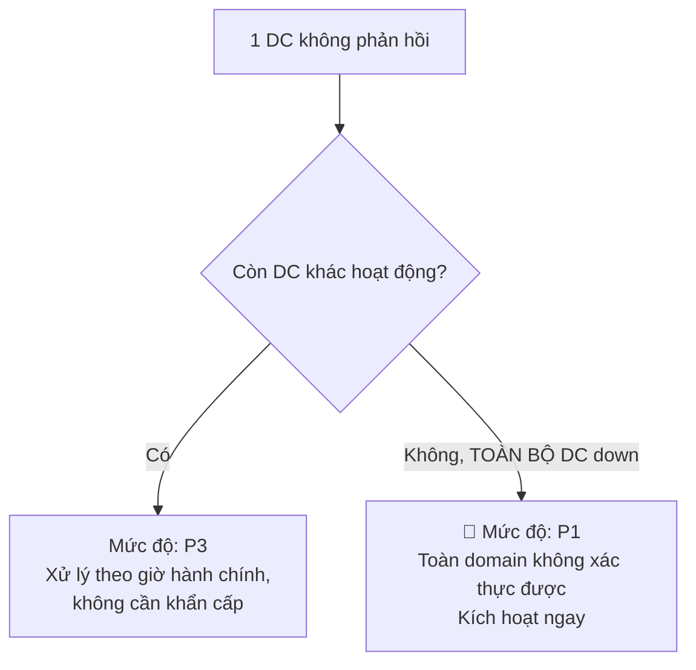

# Playbook: AD Down / DC Failure Recovery

Liên quan: [[01. Incident Severity and Escalation Matrix]] · [[../04 - Active Directory/02. AD Forest & Domain Inventory]] · [[../10 - Backup & Disaster Recovery/00. Module Overview]]

## 1. Mục đích
Quy trình khôi phục khi 1 hoặc nhiều Domain Controller gặp sự cố — phân biệt rõ giữa "còn DC khác hoạt động" (không khẩn cấp) và "toàn bộ DC down" (khủng hoảng thực sự).

## 2. Phạm vi áp dụng
Toàn bộ Domain Controller trong domain `Company.local`.

## 3. Điều kiện tiên quyết
- [ ] Đã có [[../04 - Active Directory/02. AD Forest & Domain Inventory]] cập nhật (biết DC nào giữ FSMO role nào).
- [ ] Có backup System State của từng DC.

## 4. Quy trình thực hiện

### Bước 1 — Phân loại tình huống


### Bước 2A — Trường hợp còn DC khác hoạt động (không khẩn cấp)
```powershell
# Kiểm tra tình trạng replication từ DC còn sống
repadmin /replsummary
repadmin /showrepl

# Nếu DC lỗi không khôi phục được, seize FSMO role đang giữ trên DC đó sang DC còn lại
Move-ADDirectoryServerOperationMasterRole -Identity "HQ-PRD-DC-02" -OperationMasterRole PDCEmulator,RIDMaster,InfrastructureMaster -Force
```
- [ ] Dựng lại DC mới thay thế (không cố sửa DC lỗi nếu nghi ngờ corrupt sâu — dựng mới sạch sẽ an toàn hơn).
- [ ] Cleanup metadata của DC cũ trong AD (`ntdsutil` hoặc `Remove-ADDomainController` nếu còn truy cập được).

### Bước 2B — Trường hợp TOÀN BỘ DC down (khủng hoảng — kích hoạt P1 ngay)
1. **Kích hoạt Roadmap khẩn cấp** theo [[01. Incident Severity and Escalation Matrix]].
2. Xác định DC nào có System State Backup **gần nhất và toàn vẹn nhất**.
3. Restore System State trên 1 DC trước (Authoritative hoặc Non-Authoritative tùy tình huống — xem Bước 3).
4. Sau khi 1 DC hoạt động trở lại, seize toàn bộ FSMO role về DC đó:
   ```powershell
   Move-ADDirectoryServerOperationMasterRole -Identity "HQ-PRD-DC-01" `
     -OperationMasterRole SchemaMaster,DomainNamingMaster,PDCEmulator,RIDMaster,InfrastructureMaster -Force
   ```
5. Dựng lại các DC còn lại từ đầu (không restore — join mới vào domain đã phục hồi để tránh USN Rollback).

### Bước 3 — Authoritative vs Non-Authoritative Restore (quan trọng, chọn sai gây hậu quả nghiêm trọng)
| Loại restore | Khi nào dùng |
|---|---|
| **Non-Authoritative** (mặc định) | DC sẽ đồng bộ lại dữ liệu mới nhất từ DC khác sau khi restore — dùng khi **còn ít nhất 1 DC khác lành mạnh** |
| **Authoritative** | Dùng khi cần restore này là **nguồn dữ liệu đúng duy nhất** (ví dụ vừa bị xóa nhầm 1 OU lớn trên toàn bộ DC, hoặc đây là DC cuối cùng còn lại) — dùng `ntdsutil` với lệnh `authoritative restore` |

```powershell
# Boot vào Directory Services Restore Mode (DSRM) trước khi restore
# Sau khi restore System State, nếu cần Authoritative:
ntdsutil
activate instance ntds
authoritative restore
restore subtree "OU=Users,DC=company,DC=local"
quit
quit
```

## 5. Kiểm tra sau triển khai
```powershell
dcdiag /v
repadmin /replsummary
nslookup company.local   # xác nhận DNS AD-integrated hoạt động
```
- [ ] `dcdiag` không báo lỗi nghiêm trọng.
- [ ] Replication giữa các DC đồng bộ bình thường.
- [ ] User đăng nhập được, Group Policy áp dụng đúng.

## 6. Rollback (nếu có)
Nếu Authoritative Restore gây mất dữ liệu mới hơn ngoài dự kiến, không có cách rollback — đây là lý do phải cân nhắc kỹ giữa Authoritative/Non-Authoritative trước khi thực hiện, backup thêm 1 bản trước khi restore nếu còn thời gian.

## 7. Kiểm tra bảo mật
- [ ] Sau khi khôi phục, kiểm tra lại toàn bộ GPO/Delegation còn nguyên vẹn theo [[../04 - Active Directory/05. GPO Documentation]] và [[../04 - Active Directory/06. Delegation Matrix]] — không có thay đổi trái phép trong lúc sự cố.
- [ ] Nếu nguyên nhân sự cố là do tấn công (không phải lỗi phần cứng), kết hợp [[02. Compromised Admin Account Response]].

## 8. Troubleshooting
| Sự cố | Nguyên nhân | Cách xử lý |
|---|---|---|
| Sau khi seize FSMO, DC cũ hoạt động trở lại và vẫn tưởng mình giữ FSMO role | "Split-brain" FSMO | Bắt buộc phải cleanup metadata DC cũ hoàn toàn trước khi cho nó hoạt động lại, không để 2 DC cùng tưởng mình giữ FSMO |
| USN Rollback sau khi phục hồi từ snapshot VM cũ (không phải backup chuẩn) | Restore DC bằng snapshot Hyper-V thay vì backup System State đúng chuẩn | Tuyệt đối không dùng Snapshot Hyper-V để "backup" DC — chỉ dùng System State Backup chuẩn (VM-GenerationID hỗ trợ một phần nhưng không thay thế hoàn toàn) |

## 9. Nhật ký thay đổi
| Ngày | Người thực hiện | Nội dung |
|---|---|---|

## 10. Tài liệu tham khảo
- Microsoft Learn: AD DS Backup and Recovery
- [[../04 - Active Directory/02. AD Forest & Domain Inventory]]

## Tags
#incident-response #active-directory #fsmo #critical
