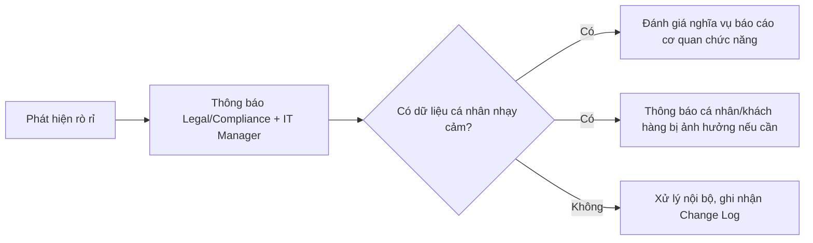

# Playbook: Data Leak Response

Liên quan: [[01. Incident Severity and Escalation Matrix]] · [[02. Compromised Admin Account Response]] · [[../01 - Governance/06. Security Policy]]

## 1. Mục đích
Quy trình xử lý khi phát hiện dữ liệu công ty (dữ liệu khách hàng, tài chính, nhân sự) bị rò rỉ ra ngoài — bao gồm cả nghĩa vụ tuân thủ pháp lý tại Việt Nam.

## 2. Phạm vi áp dụng
Mọi sự cố lộ dữ liệu: qua email gửi nhầm, USB, tấn công mạng, tài khoản bị xâm nhập, nhân viên cố ý.

## 3. Điều kiện tiên quyết
- [ ] Đã xác định người phụ trách pháp lý/tuân thủ (Legal/Compliance Officer, hoặc IT Manager kiêm nhiệm nếu công ty chưa có vị trí riêng).

## 4. Quy trình thực hiện

### Bước 1 — Containment (ngăn rò rỉ tiếp diễn)
1. Nếu do tài khoản bị xâm nhập → thực hiện song song [[02. Compromised Admin Account Response]].
2. Thu hồi ngay quyền truy cập của người/tài khoản liên quan tới nguồn rò rỉ.
3. Nếu qua email gửi nhầm nội bộ (M365) — dùng chức năng **Recall/Remove message** (chỉ hiệu quả nếu người nhận nội bộ chưa mở).

### Bước 2 — Xác định phạm vi dữ liệu bị lộ
- [ ] Loại dữ liệu: dữ liệu cá nhân khách hàng? Dữ liệu tài chính? Dữ liệu nhân sự nội bộ?
- [ ] Số lượng bản ghi/người bị ảnh hưởng ước tính.
- [ ] Dữ liệu đã bị truy cập hay chỉ mới "có khả năng truy cập được" (2 mức độ nghiêm trọng khác nhau).

### Bước 3 — Nghĩa vụ tuân thủ pháp lý (Việt Nam)
Theo **Nghị định 13/2023/NĐ-CP về Bảo vệ dữ liệu cá nhân**, nếu sự cố liên quan dữ liệu cá nhân:
- [ ] Đánh giá có thuộc diện phải thông báo cơ quan chức năng (Bộ Công an - Cục An ninh mạng) không.
- [ ] Nếu ảnh hưởng dữ liệu cá nhân nhạy cảm (theo định nghĩa Nghị định), thời hạn thông báo có thể rất ngắn — **liên hệ ngay bộ phận pháp lý/luật sư tư vấn**, không tự ý đánh giá và bỏ qua nghĩa vụ này.
> Đây là lĩnh vực thay đổi theo quy định pháp luật hiện hành — IT không tự quyết định có/không cần báo cáo, luôn phối hợp bộ phận pháp lý.

### Bước 4 — Thông báo nội bộ và các bên liên quan

### Bước 5 — Điều tra nguyên nhân gốc
Dùng Auditing (Phase 9) để xác định: ai truy cập, khi nào, qua kênh nào, dữ liệu cụ thể gì.

## 5. Kiểm tra sau triển khai
- [ ] Nguồn rò rỉ đã được chặn hoàn toàn (không còn khả năng tiếp tục rò rỉ).
- [ ] Đã hoàn tất đánh giá nghĩa vụ báo cáo pháp lý (có/không cần báo cáo, có ghi nhận lý do quyết định).

## 6. Rollback (nếu có)
Không áp dụng — dữ liệu đã rò rỉ không thể "thu hồi" hoàn toàn, chỉ có thể containment và giảm thiểu thiệt hại tiếp theo.

## 7. Kiểm tra bảo mật
- [ ] Rà soát lại quyền truy cập dữ liệu nhạy cảm liên quan — có đang tuân thủ Least Privilege không (đối chiếu [[../03 - Identity & Access Management/03. Least Privilege Principle]]).
- [ ] Xem xét bổ sung DLP (Data Loss Prevention) nếu sự cố lặp lại hoặc rủi ro cao.

## 8. Troubleshooting
| Sự cố | Nguyên nhân | Cách xử lý |
|---|---|---|
| Không chắc dữ liệu có thuộc diện phải báo cáo cơ quan chức năng | Thiếu chuyên môn pháp lý trong team IT | Không tự quyết định — luôn tham vấn Legal/luật sư ngoài, ưu tiên thận trọng |

## 9. Nhật ký thay đổi
| Ngày | Người thực hiện | Nội dung |
|---|---|---|

## 10. Tài liệu tham khảo
- Nghị định 13/2023/NĐ-CP về Bảo vệ dữ liệu cá nhân
- [[../01 - Governance/06. Security Policy]]

## Tags
#incident-response #data-leak #compliance #legal
