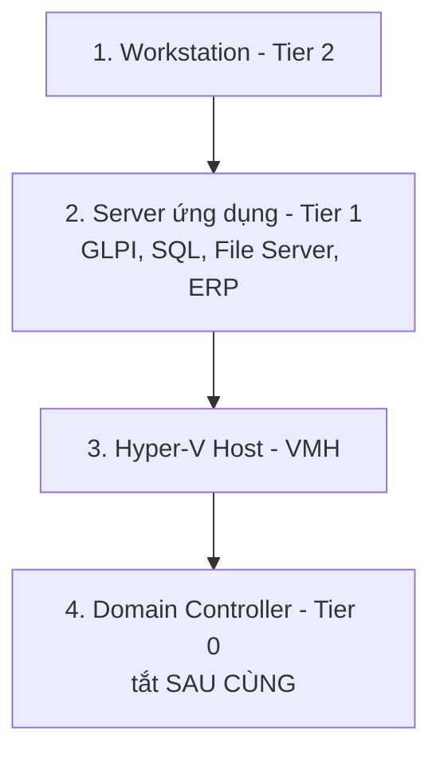
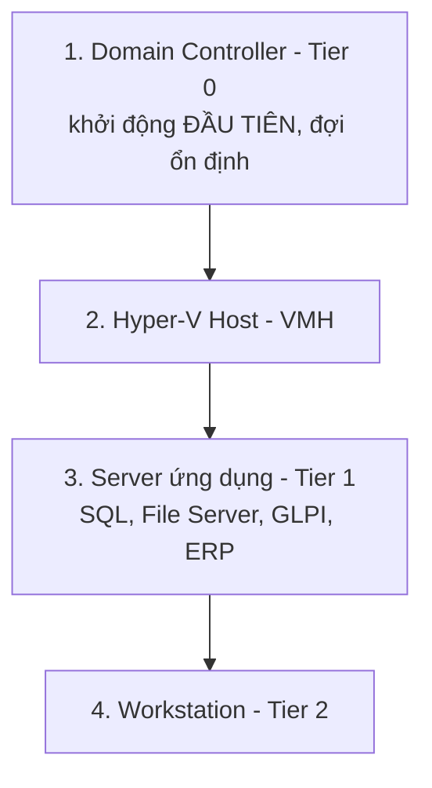

# Playbook: Power Failure / Network Down

Liên quan: [[01. Incident Severity and Escalation Matrix]] · [[../16 - Checklists/01. Daily Checklist]]

## 1. Mục đích
Quy trình xử lý mất điện diện rộng và mất kết nối mạng — đặc biệt thứ tự tắt/khởi động lại server đúng chuẩn để tránh hỏng dữ liệu (đặc biệt AD/SQL).

## 2. Phạm vi áp dụng
Toàn bộ hạ tầng Server/Network.

## 3. Điều kiện tiên quyết
- [ ] Đã biết thời gian dự phòng (runtime) thực tế của UPS phòng Server.

## 4. Quy trình thực hiện

### Kịch bản A — Mất điện, còn UPS
1. Kiểm tra thời gian UPS còn lại: nếu ước tính mất điện sẽ **kéo dài hơn runtime UPS**, chủ động shutdown theo đúng thứ tự (Bước dưới) — không đợi tới khi UPS cạn mới tắt khẩn cấp.

### Thứ tự Shutdown an toàn (ngược thứ tự Tier — Tier 2 trước, Tier 0 sau cùng)

> **Lý do:** Server ứng dụng (Tier 1) phụ thuộc DC để xác thực — tắt DC trước sẽ khiến các server khác gặp lỗi trong quá trình tắt. Domain Controller luôn là máy **tắt sau cùng, khởi động lại đầu tiên**.

### Thứ tự Khởi động lại (đúng thứ tự Tier — Tier 0 trước, Tier 2 sau cùng)

```powershell
# Sau khi có điện trở lại, kiểm tra DC hoạt động ổn định trước khi khởi động server khác
dcdiag /v
repadmin /replsummary
```
- [ ] Đợi DC hoàn toàn ổn định (dcdiag sạch) trước khi khởi động SQL/File Server/GLPI — tránh lỗi xác thực domain trong lúc các service đang start.

### Kịch bản B — Mất mạng diện rộng (không phải mất điện)
1. Xác định phạm vi: 1 phòng ban hay toàn công ty? (đối chiếu [[../01 - End-User Self-Service/1.2 Network & Connectivity/[Network] Xử lý nhanh khi mất mạng|hướng dẫn End-User]] trong GLPI KB để loại trừ nguyên nhân cục bộ trước).
2. Kiểm tra Core Switch/Firewall còn hoạt động không.
3. Nếu do ISP (mất Internet nhưng mạng nội bộ vẫn chạy) → liên hệ nhà mạng, không phải sự cố nội bộ, hạ mức độ ưu tiên xuống P3 nếu mạng nội bộ vẫn hoạt động bình thường.
4. Nếu mất toàn bộ mạng nội bộ (LAN) → kiểm tra Core Switch trước tiên (điểm lỗi trung tâm phổ biến nhất).

## 5. Kiểm tra sau triển khai
- [ ] Toàn bộ dịch vụ hoạt động lại đúng thứ tự, không có lỗi database corrupt (đặc biệt SQL Server — kiểm tra log sau khi khởi động lại đột ngột).
- [ ] `dcdiag` và `repadmin /replsummary` sạch.

## 6. Rollback (nếu có)
Không áp dụng.

## 7. Kiểm tra bảo mật
- [ ] Sau sự cố mất điện đột ngột không qua UPS (nếu UPS hết pin trước khi kịp shutdown), kiểm tra kỹ database SQL/AD có dấu hiệu corrupt không trước khi coi là "đã ổn".

## 8. Troubleshooting
| Sự cố | Nguyên nhân | Cách xử lý |
|---|---|---|
| SQL Server không start sau mất điện đột ngột | Database ở trạng thái "Suspect" do transaction dở dang | Chạy `DBCC CHECKDB`, khôi phục từ backup gần nhất nếu không tự phục hồi được |
| DC khởi động nhưng báo lỗi replication | DC khác chưa kịp online, hoặc chênh lệch thời gian đồng hồ (Kerberos nhạy cảm với time skew) | Đợi toàn bộ DC online, kiểm tra NTP đồng bộ đúng trước khi lo lắng về replication |

## 9. Nhật ký thay đổi
| Ngày | Người thực hiện | Nội dung |
|---|---|---|

## 10. Tài liệu tham khảo
- [[../16 - Checklists/03. Monthly Checklist]] (test UPS định kỳ)

## Tags
#incident-response #power-failure #network-down

---
**Module 15 — Incident Response hoàn tất (6 tài liệu: Severity Matrix + 5 Playbook).**
