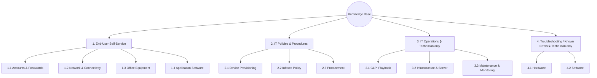

# Category Structure — Cây danh mục Knowledge Base

Liên quan: [[01. KB Setup Guide]]

## Cây danh mục đầy đủ (tên tạo trong `Setup > Dropdowns > Knowledge base category`)

| Mã | Tên Category (nhập trong GLPI) | Category cha | Visibility |
|---|---|---|---|
| 1 | End-User Self-Service | (gốc) | Public (toàn công ty) |
| 1.1 | Accounts & Passwords | End-User Self-Service | Public |
| 1.2 | Network & Connectivity | End-User Self-Service | Public |
| 1.3 | Office Equipment | End-User Self-Service | Public |
| 1.4 | Application Software | End-User Self-Service | Public |
| 2 | IT Policies & Procedures | (gốc) | Public (toàn công ty) |
| 2.1 | Device Provisioning | IT Policies & Procedures | Public |
| 2.2 | Infosec Policy | IT Policies & Procedures | Public |
| 2.3 | Procurement | IT Policies & Procedures | Public |
| 3 | IT Operations (Technician Only) | (gốc) | **Technician/Supervisor/Super-Admin only** |
| 3.1 | GLPI Playbook | IT Operations | Technician only |
| 3.2 | Infrastructure & Server | IT Operations | Technician only |
| 3.3 | Maintenance & Monitoring | IT Operations | Technician only |
| 4 | Troubleshooting / Known Errors | (gốc) | **Technician/Supervisor/Super-Admin only** |
| 4.1 | Hardware | Troubleshooting / Known Errors | Technician only |
| 4.2 | Software | Troubleshooting / Known Errors | Technician only |

## Sơ đồ trực quan

## Danh sách bài viết đã biên soạn theo từng Category

### 1.1 Accounts & Passwords
- [[../01. End-User Self-Service/1.1 Accounts & Passwords/[AD] Đổi mật khẩu Windows-AD]]
- [[[2FA] Cấu hình xác thực 2 lớp]]
- [[[ERP-CRM] Reset mật khẩu phần mềm ERP-CRM]]

### 1.2 Network & Connectivity
- [[[WiFi] Kết nối WiFi công ty]]
- [[[VPN] Cấu hình VPN làm việc từ xa]]
- [[[Network] Xử lý nhanh khi mất mạng]]

### 1.3 Office Equipment
- [[[Printer] Kết nối máy in dùng chung]]
- [[../01. End-User Self-Service/1.3 Office Equipment/[Printer] Xử lý kẹt giấy]]
- [[../01. End-User Self-Service/1.3 Office Equipment/[Meeting Room] Setup phòng họp - máy chiếu]]

### 1.4 Application Software
- [[[Outlook] Cài đặt và cấu hình Email]]
- [[[O365] Sử dụng cơ bản Office 365]]
- [[[Teams] Sử dụng Chat nội bộ]]

### 2.1 Device Provisioning
- [[[SOP] Đăng ký nhận Laptop mới]]
- [[../02. IT Policies & Procedures/2.1 Device Provisioning/[SOP] Bàn giao thiết bị khi nghỉ việc - chuyển bộ phận]]

### 2.2 Infosec Policy
- [[[Policy] Quy định đặt mật khẩu an toàn]]
- [[../02. IT Policies & Procedures/2.2 Infosec Policy/[Policy] Quy định cài phần mềm ngoài và USB]]

### 2.3 Procurement
- [[../02. IT Policies & Procedures/2.3 Procurement/[Form] Yêu cầu mua sắm thiết bị]]

### 3.1 GLPI Playbook
- [[[GLPI Agent] Sửa lỗi usb.ids]]
- [[[GLPI Agent] Sửa lỗi Network Discovery critical error]]
- [[[GLPI Agent] Sửa lỗi configuration already sent]]
- [[[GLPI] Tạo Rule tự động gán Entity]]
- [[[GLPI] Quản lý kho Asset]]

### 3.2 Infrastructure & Server
- [[[Network] Sơ đồ mạng và Danh sách IP tĩnh]]
- [[[Backup] Quy trình backup-restore Server]]
- [[[Firewall] Hướng dẫn quản trị Firewall]]

### 3.3 Maintenance & Monitoring
- [[[SOP] Lịch kiểm tra định kỳ phòng Server]]
- [[[Zabbix-Grafana] Xử lý cảnh báo Alert]]

### 4.1 Hardware
- [[[Hardware] Máy tính không lên nguồn]]
- [[[Hardware] Màn hình xanh BSOD]]

### 4.2 Software
- [[[Outlook] Lỗi không nhận - gửi được mail]]
- [[[Office] Lỗi font Word - Excel]]
- [[../04. Troubleshooting Known Errors/4.2 Software/[Misa-Bravo] Lỗi phần mềm kế toán]]

**Liên kết:** [[03. Article Template]] · [[04. Bulk Import Script]]
