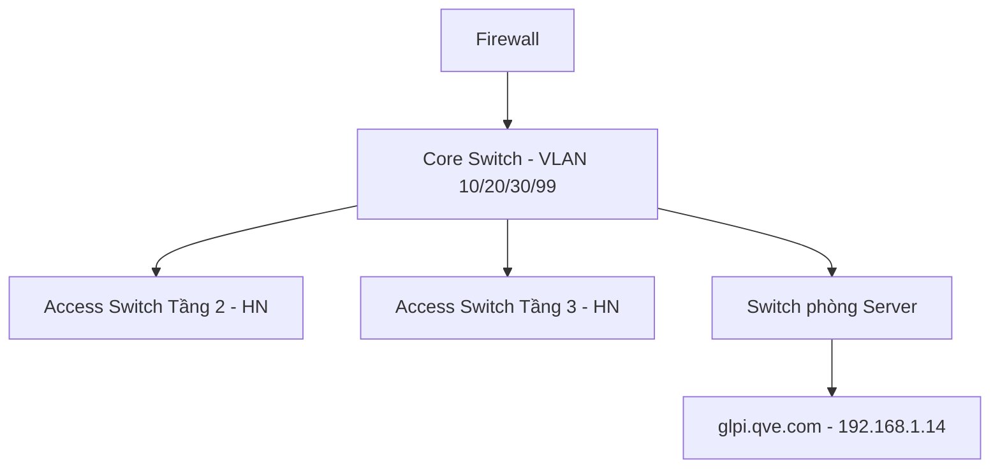

# [Network] Sơ đồ mạng (Network Topology) & Danh sách IP tĩnh

## 1. Tóm tắt hiện tượng (Symptom)
Kỹ thuật viên mới hoặc khi xử lý sự cố cần tra cứu nhanh sơ đồ mạng tổng thể và danh sách IP tĩnh đang cấp phát cho server/thiết bị hạ tầng.

## 2. Nguyên nhân (Root Cause)
Đây là tài liệu tham chiếu (không phải sự cố) — cần duy trì luôn cập nhật để tránh cấp trùng IP hoặc mất thời gian dò tìm khi xử lý sự cố khẩn cấp.

## 3. Các bước xử lý (Resolution)
**Sơ đồ mạng logic:**

**Danh sách IP tĩnh cốt lõi (cập nhật khi có thay đổi hạ tầng):**
| Thiết bị | IP | VLAN | Ghi chú |
|---|---|---|---|
| GLPI Server | 192.168.1.14 | 20 | Xem chi tiết dựng server tại tài liệu Deployment Manual |
| Domain Controller | 192.168.1.10 | 20 | |
| Core Switch | 192.168.1.1 | 99 | Quản trị |
| Firewall (LAN interface) | 192.168.1.254 | 99 | |

> Danh sách đầy đủ nên duy trì trong file IPAM riêng (Excel/Netbox) và chỉ đồng bộ bảng tóm tắt vào đây — bài KB này không thay thế công cụ quản lý IP chuyên dụng.

## 4. Thông tin bổ sung (Notes)
- Mọi thay đổi IP tĩnh phải cập nhật ngay vào tài liệu này **và** vào Asset tương ứng trong GLPI (`Assets > Network Equipment`).
- Liên quan: [[[Firewall] Hướng dẫn quản trị Firewall]]
