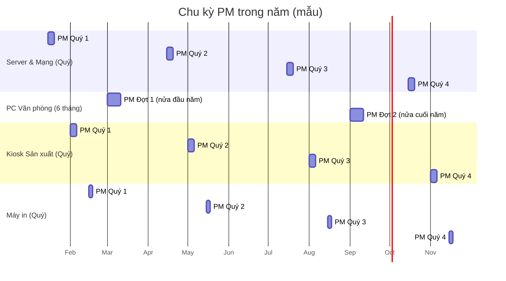

# 📅 IT-HW-Annual-Maintenance-Plan

**Kế hoạch Bảo dưỡng Định kỳ Phần cứng IT — Hàng năm**
Nhà máy may mặc QVN | Phiên bản: v1.0 | Người phê duyệt: IT Manager

---

## 1. Mục đích
Kế hoạch này xác định phạm vi, tần suất, nguồn lực và lịch trình bảo dưỡng định kỳ (Preventive Maintenance — PM) cho toàn bộ phần cứng IT của nhà máy, nhằm:
- Giảm thiểu sự cố đột xuất (unplanned downtime) ảnh hưởng đến vận hành sản xuất/văn phòng.
- Kéo dài tuổi thọ thiết bị, tối ưu chi phí thay mới.
- Đảm bảo tuân thủ các SOP hạ tầng đã ban hành (Windows Server/AD, NPS/RADIUS, CBS350, FortiGate, UniFi — xem bộ *QVN Network Infrastructure SOP v1.0*).

## 2. Phạm vi tài sản (Asset Scope)

| Nhóm tài sản | Số lượng ước tính | Vị trí | Mức độ ưu tiên |
|---|---|---|---|
| PC/Laptop văn phòng | [Điền số lượng thực tế] | Khu văn phòng | Trung bình |
| Kiosk/PC khu sản xuất (Dashboard/MES) | [Điền số lượng] | Khu xưởng | **Cao** — ảnh hưởng trực tiếp sản xuất |
| Máy in (văn phòng + tem nhãn xưởng) | [Điền số lượng] | Văn phòng + Xưởng | Trung bình |
| Server (AD/DNS/NPS, UniFi Controller) | [Điền số lượng] | Phòng máy chủ (VLAN 10) | **Rất cao** |
| Thiết bị mạng (CBS350, FortiGate, UniFi AP) | [Điền số lượng] | Toàn nhà máy | **Rất cao** |
| UPS/Nguồn dự phòng | [Điền số lượng] | Phòng máy chủ, tủ mạng | **Cao** |

📌 Danh sách tài sản chi tiết (số serial, vị trí cụ thể, ngày mua, hạn bảo hành) quản lý tại `10. Maintenance-Schedule.xlsx` — đây là nguồn dữ liệu vận hành chính, tài liệu này chỉ nêu kế hoạch tổng thể.

## 3. Tần suất bảo dưỡng chuẩn theo loại thiết bị

| Loại thiết bị | Tần suất PM | Thời điểm khuyến nghị | Tài liệu tham chiếu |
|---|---|---|---|
| Server (AD/NPS/UniFi Controller) | Hàng quý (3 tháng/lần) | Cuối tuần, ngoài giờ | [[02. SOP-Preventive-Maintenance]] |
| Thiết bị mạng (Switch/Firewall/AP) | Hàng quý | Cuối tuần | [[06. Maintenance-Checklist-Network]] |
| PC/Laptop văn phòng | 6 tháng/lần | Giờ hành chính, theo lịch luân phiên | [[04. Maintenance-Checklist-PC]] |
| Kiosk/PC khu sản xuất | Hàng quý (môi trường bụi, nhiệt độ cao hơn văn phòng) | Ngoài giờ sản xuất/giờ nghỉ ca | [[04. Maintenance-Checklist-PC]] |
| Máy in | 3 tháng/lần (hoặc theo mức sử dụng) | Giờ hành chính | [[05. Maintenance-Checklist-Printer]] |
| UPS | 6 tháng/lần (kèm test tải) | Cuối tuần | [[02. SOP-Preventive-Maintenance]] |

📌 Kiosk khu sản xuất có tần suất PM **dày hơn** PC văn phòng do môi trường nhiều bụi vải, độ ẩm/nhiệt độ cao hơn — đúng theo đặc thù đã ghi nhận trong `FactoryBusiness.md` (bộ tài liệu QVN AI Coding Team).

## 4. Chu kỳ lịch tổng thể trong năm

📌 Lịch cụ thể theo từng thiết bị (ngày thực hiện, người phụ trách, trạng thái) quản lý chi tiết tại `10. Maintenance-Schedule.xlsx`.

## 5. Vai trò & trách nhiệm

| Vai trò | Trách nhiệm |
|---|---|
| IT Manager | Lập kế hoạch, phê duyệt, theo dõi KPI, xử lý sự cố vượt phạm vi PM |
| Kỹ thuật viên hỗ trợ (nếu có/thuê ngoài) | Thực hiện PM theo checklist, ghi báo cáo |
| Quản lý sản xuất | Phối hợp lên lịch PM khu vực xưởng không ảnh hưởng ca sản xuất |
| Nhà cung cấp/bảo hành (Cisco, Fortinet, Ubiquiti, hãng PC/Printer) | Hỗ trợ khi sự cố vượt khả năng nội bộ — xem Escalation Matrix trong bộ SOP hạ tầng mạng |

## 6. Ngân sách & nguồn lực (khung tham khảo)

| Hạng mục | Ước tính | Ghi chú |
|---|---|---|
| Vật tư tiêu hao (khăn lau, khí nén, keo tản nhiệt, mực in) | [Điền ngân sách] | Mua định kỳ theo quý |
| Linh kiện thay thế dự phòng (RAM, ổ cứng, quạt tản nhiệt, cáp mạng) | [Điền ngân sách] | Xem tồn kho tại [[03. SOP-Hardware-Repair]] mục Spare Parts |
| Hợp đồng bảo trì thuê ngoài (nếu có) | [Điền ngân sách] | Đối với thiết bị mạng lõi nếu cần hỗ trợ chuyên sâu |
| Dự phòng thay thế thiết bị hết khấu hao | [Điền ngân sách] | Theo chu kỳ khấu hao tài sản của công ty |

## 7. Chỉ số theo dõi thành công của kế hoạch
Xem chi tiết đầy đủ tại [[09. KPI-Hardware-Maintenance]] — các chỉ số chính: **Tỷ lệ tuân thủ lịch PM (PM Compliance Rate)**, **MTTR**, **MTBF**, **Uptime thiết bị quan trọng**.

## 8. Rà soát & cập nhật kế hoạch
- Rà soát kế hoạch này **1 lần/năm** (cuối năm, chuẩn bị cho năm kế tiếp) hoặc khi có thay đổi lớn về số lượng/loại thiết bị.
- Mọi thay đổi ghi nhận vào lịch sử cập nhật cuối tài liệu.

---
**Lịch sử cập nhật**

| Ngày | Version | Người cập nhật | Nội dung |
|---|---|---|---|
| 2026-07-09 | v1.0 | IT Manager | Phát hành lần đầu |
