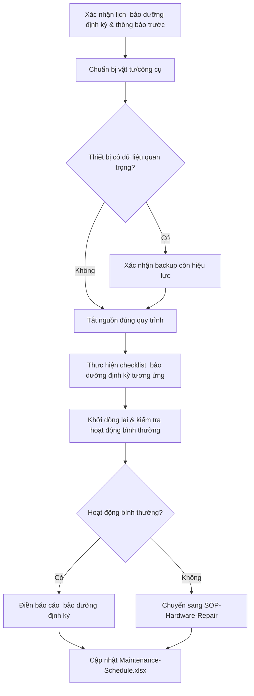

# 🛠️ SOP-Preventive-Maintenance

**Quy trình Vận hành Chuẩn — Bảo dưỡng Định kỳ (Preventive Maintenance)**
Mã tài liệu: SOP-ITHW-002 | Phiên bản: v1.0

---

## 1. Mục đích & Phạm vi áp dụng
Quy trình này áp dụng cho toàn bộ hoạt động bảo dưỡng định kỳ trên phần cứng IT của nhà máy: PC/Laptop, Kiosk sản xuất, Máy in, Server, Thiết bị mạng, UPS. Đây là quy trình **phòng ngừa** (trước khi hỏng), khác với [[03. SOP-Hardware-Repair]] là quy trình **khắc phục** (sau khi đã hỏng/báo lỗi).

## 2. Nguyên tắc chung
1. **Không thực hiện  bảo dưỡng định kỳ khi chưa lên lịch và thông báo trước** — trừ trường hợp khẩn cấp đã có quy trình riêng.
2. **Luôn tắt nguồn/ngắt điện đúng cách trước khi vệ sinh phần cứng bên trong** — tuân thủ an toàn điện.
3. **Ghi nhận đầy đủ vào báo cáo** ([[07. Maintenance-Report-Template]]) sau mỗi lần  bảo dưỡng định kỳ — không có  bảo dưỡng định kỳ nào được coi là hoàn thành nếu chưa có báo cáo.
4. **Ưu tiên  bảo dưỡng định kỳ ngoài giờ hoạt động** đối với thiết bị ảnh hưởng trực tiếp sản xuất (kiosk, server, thiết bị mạng).

## 3. Quy trình chuẩn bị trước khi thực hiện  bảo dưỡng định kỳ

### Bước 1 — Lên lịch
1. Đối chiếu `10. Maintenance-Schedule.xlsx` — xác nhận thiết bị đến hạn  bảo dưỡng định kỳ.
2. Với thiết bị khu sản xuất: phối hợp với Quản lý sản xuất chọn khung giờ không ảnh hưởng ca làm việc (giờ nghỉ ca, cuối tuần).
3. Thông báo trước tối thiểu 24 giờ cho người dùng/bộ phận liên quan (trừ  bảo dưỡng định kỳ không cần tắt máy).

### Bước 2 — Chuẩn bị vật tư & công cụ
- [ ] Khăn lau chuyên dụng, khí nén (compressed air) vệ sinh bụi.
- [ ] Cồn isopropyl (IPA) vệ sinh linh kiện, không dùng nước/hoá chất ăn mòn.
- [ ] Tua vít, vòng đeo tay chống tĩnh điện (ESD wrist strap) — bắt buộc khi mở case PC/Server.
- [ ] Checklist tương ứng loại thiết bị ([[04. Maintenance-Checklist-PC]] / [[05. Maintenance-Checklist-Printer]] / [[06. Maintenance-Checklist-Network]]).
- [ ] Biểu mẫu báo cáo ([[07. Maintenance-Report-Template]]).

### Bước 3 — Backup trước khi  bảo dưỡng định kỳ (thiết bị có dữ liệu/cấu hình quan trọng)
🔒 Đối với Server/Thiết bị mạng, **bắt buộc xác nhận backup gần nhất còn hiệu lực** trước khi thực hiện  bảo dưỡng định kỳ có tắt nguồn/khởi động lại — tham chiếu quy trình backup tại bộ *QVN Network Infrastructure SOP v1.0 → 06_Van_Hanh_Chuan/01_Quy_Trinh_Backup_Tong_The*.

## 4. Quy trình thực hiện  bảo dưỡng định kỳ (các bước chung)

## 5. Các hạng mục  bảo dưỡng định kỳ chung (áp dụng mọi loại thiết bị)

| Hạng mục | Mô tả |
|---|---|
| **Vệ sinh vật lý** | Loại bỏ bụi bẩn bên trong/ngoài, đặc biệt quạt tản nhiệt, khe thông gió |
| **Kiểm tra kết nối** | Cáp nguồn, cáp mạng, cáp tín hiệu cắm chắc chắn, không lỏng/oxi hoá |
| **Kiểm tra nhiệt độ vận hành** | Không quá nóng bất thường so với thông số nhà sản xuất |
| **Kiểm tra tình trạng nguồn điện** | Nguồn ổn định, không có dấu hiệu chập chờn, UPS còn hoạt động tốt |
| **Cập nhật phần mềm/firmware** | Theo lịch đã duyệt, không cập nhật tuỳ tiện ngoài kế hoạch (xem Change Management trong bộ SOP hạ tầng mạng) |
| **Kiểm tra log/lỗi hệ thống** | Rà soát log gần nhất, phát hiện dấu hiệu bất thường trước khi thành sự cố lớn |
| **Kiểm tra vật tư tiêu hao** | Mực in, pin CMOS, tình trạng ổ cứng (SMART status) |

## 6. An toàn lao động khi thực hiện  bảo dưỡng định kỳ
⚠️ Các nguyên tắc bắt buộc:
- Luôn ngắt nguồn điện hoàn toàn trước khi mở case/vệ sinh linh kiện bên trong.
- Đeo vòng chống tĩnh điện khi tiếp xúc trực tiếp linh kiện (RAM, mainboard, card mở rộng).
- Không vệ sinh thiết bị điện khi tay ướt hoặc trong môi trường ẩm ướt.
- Với thiết bị trong tủ mạng/phòng máy chủ: đảm bảo thông gió khi làm việc, tủ mạng có thể tích nhiệt cao.
- Không tự ý sửa chữa/can thiệp phần cứng vượt quá phạm vi  bảo dưỡng định kỳ (VD: hàn mạch) — chuyển sang quy trình bảo hành/thuê ngoài.

## 7. Xử lý khi phát hiện bất thường trong lúc  bảo dưỡng định kỳ
📌 Nếu trong quá trình  bảo dưỡng định kỳ phát hiện dấu hiệu hỏng hóc/xuống cấp (quạt kêu to bất thường, tụ điện phồng, ổ cứng cảnh báo SMART):
1. **Không cố khắc phục ngay trong khuôn khổ  bảo dưỡng định kỳ** nếu vượt phạm vi vệ sinh/kiểm tra thông thường.
2. Ghi nhận vào báo cáo  bảo dưỡng định kỳ, đánh dấu mức độ ưu tiên xử lý.
3. Chuyển sang quy trình [[03. SOP-Hardware-Repair]] nếu cần sửa chữa/thay thế.

## 8. Hoàn tất  bảo dưỡng định kỳ
- [ ] Khởi động lại thiết bị, xác nhận hoạt động bình thường.
- [ ] Điền đầy đủ [[07. Maintenance-Report-Template]].
- [ ] Cập nhật trạng thái trong `10. Maintenance-Schedule.xlsx` (ngày thực hiện, người thực hiện, kết quả).
- [ ] Thông báo lại cho người dùng/bộ phận liên quan thiết bị đã sẵn sàng sử dụng.

## 9. Tài liệu liên quan
- [[04. Maintenance-Checklist-PC]]
- [[05. Maintenance-Checklist-Printer]]
- [[06. Maintenance-Checklist-Network]]
- [[03. SOP-Hardware-Repair]]
- [[09. KPI-Hardware-Maintenance]]
