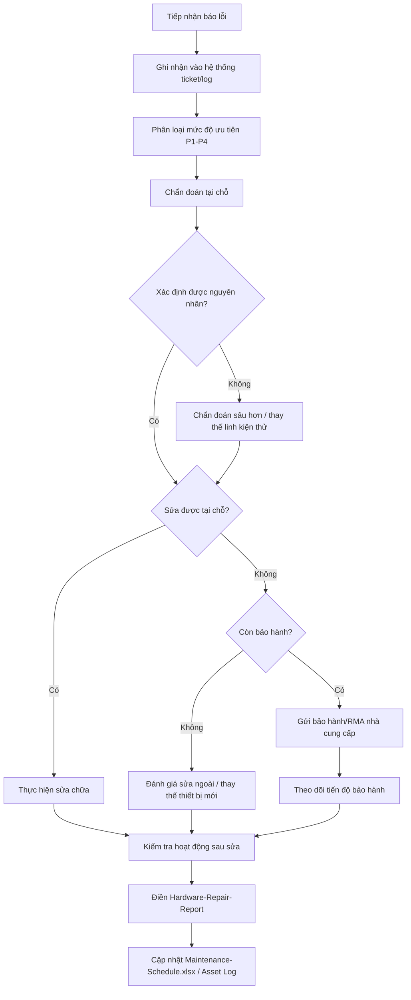

# 🔧 SOP-Hardware-Repair

**Quy trình Vận hành Chuẩn — Sửa chữa Phần cứng (Corrective Maintenance)**
Mã tài liệu: SOP-ITHW-003 | Phiên bản: v1.0

---

## 1. Mục đích & Phạm vi
Quy trình này áp dụng khi phần cứng IT **đã xảy ra sự cố/báo lỗi** (khác với  bảo dưỡng định kỳ phòng ngừa tại [[02. SOP-Preventive-Maintenance]]), bao gồm: tiếp nhận báo lỗi, chẩn đoán, sửa chữa/thay thế, kiểm tra sau sửa, và xử lý bảo hành/RMA.

## 2. Phân loại mức độ ưu tiên sự cố phần cứng

| Mức độ | Định nghĩa | Ví dụ | Thời gian phản hồi mục tiêu |
|---|---|---|---|
| **P1 - Khẩn cấp** | Ảnh hưởng trực tiếp sản xuất/toàn nhà máy | Server AD/NPS hỏng, switch Core hỏng, kiosk MES toàn bộ 1 chuyền không hoạt động | Ngay lập tức, ≤ 30 phút |
| **P2 - Cao** | Ảnh hưởng 1 khu vực/cá nhân nhưng có ảnh hưởng công việc rõ rệt | 1 kiosk hỏng, 1 PC quản lý sản xuất không lên máy | ≤ 2 giờ |
| **P3 - Trung bình** | Ảnh hưởng cục bộ, có giải pháp thay thế tạm thời | Máy in văn phòng lỗi (còn máy in khác), 1 PC văn phòng chậm | ≤ 1 ngày làm việc |
| **P4 - Thấp** | Không ảnh hưởng công việc ngay | Bàn phím/chuột lỗi có thể thay nhanh, hao mòn nhẹ | Theo lịch xử lý thông thường |

## 3. Quy trình xử lý sự cố phần cứng

## 4. Tiếp nhận & ghi nhận báo lỗi
Mọi báo lỗi (dù qua điện thoại, trực tiếp, hay hệ thống ticket nếu có) phải ghi nhận tối thiểu:
- Thời gian báo lỗi.
- Người báo lỗi + bộ phận.
- Thiết bị/vị trí gặp sự cố.
- Mô tả triệu chứng (càng chi tiết càng tốt — tránh chỉ ghi "không lên máy").

## 5. Chẩn đoán tại chỗ (Triage)
📌 Nguyên tắc chẩn đoán từ đơn giản đến phức tạp — tránh vội vàng thay thế linh kiện đắt tiền khi chưa loại trừ nguyên nhân đơn giản:
1. Kiểm tra nguồn điện/cáp kết nối trước tiên (nguyên nhân phổ biến nhất, dễ bỏ qua).
2. Kiểm tra đèn báo trạng thái (LED) trên thiết bị.
3. Khởi động lại thiết bị (nếu an toàn để làm vậy) — loại trừ lỗi phần mềm tạm thời.
4. Thử với linh kiện/cáp thay thế đã biết hoạt động tốt (swap test) để cô lập nguyên nhân.
5. Nếu là PC/Laptop: kiểm tra qua BIOS/Safe Mode để phân biệt lỗi phần cứng và phần mềm.

## 6. Quản lý linh kiện thay thế (Spare Parts Inventory)

| Linh kiện dự phòng | Số lượng tồn kho tối thiểu | Ghi chú |
|---|---|---|
| RAM (loại phổ biến đang dùng) | 2-4 thanh | Theo chuẩn PC/Kiosk đang triển khai |
| Ổ cứng SSD/HDD | 2-3 cái | Ưu tiên SSD cho kiosk (chịu rung động tốt hơn) |
| Nguồn PC (PSU) | 1-2 cái | |
| Quạt tản nhiệt (CPU, case) | 3-5 cái | Hao mòn nhanh trong môi trường bụi xưởng |
| Cáp mạng (đã bấm sẵn, nhiều độ dài) | 10+ sợi | |
| Chuột, bàn phím | 3-5 bộ | Hao mòn nhanh nhất trong các linh kiện |
| Bộ nguồn UPS/Ắc quy UPS | Theo khuyến nghị nhà sản xuất | Kiểm tra hạn sử dụng ắc quy định kỳ |

📌 Rà soát tồn kho linh kiện **hàng quý**, bổ sung trước khi hết — đặc biệt các linh kiện hao mòn nhanh do môi trường xưởng (quạt tản nhiệt, chuột/bàn phím).

## 7. Quy trình bảo hành / RMA (Return Merchandise Authorization)
1. Xác nhận thiết bị còn trong thời hạn bảo hành (đối chiếu ngày mua + thời hạn bảo hành trong `10. Maintenance-Schedule.xlsx`).
2. Liên hệ nhà cung cấp/hãng theo thông tin bảo hành, mô tả lỗi rõ ràng kèm số serial.
3. Chuẩn bị thiết bị đúng quy cách gửi bảo hành (đóng gói an toàn, xoá dữ liệu nhạy cảm nếu là ổ cứng/thiết bị lưu trữ theo chính sách bảo mật công ty).
4. Theo dõi tiến độ, ghi nhận thời gian gửi/nhận lại.
5. Kiểm tra hoạt động đầy đủ sau khi nhận lại thiết bị bảo hành trước khi đưa vào sử dụng lại.

⚠️ **Với thiết bị mạng lõi (CBS350, FortiGate)**: trước khi gửi bảo hành, luôn **backup cấu hình** theo quy trình trong bộ *QVN Network Infrastructure SOP v1.0* tương ứng từng thiết bị — không gửi bảo hành khi chưa có bản backup cấu hình gần nhất.

## 8. Quyết định Sửa chữa vs Thay thế (Repair vs Replace)
📌 Nguyên tắc tham khảo — cân nhắc theo tình hình thực tế và ngân sách:

| Tiêu chí | Nghiêng về Sửa chữa | Nghiêng về Thay thế |
|---|---|---|
| Chi phí sửa so với giá trị còn lại thiết bị | Chi phí < 30% giá trị còn lại | Chi phí > 50% giá trị còn lại |
| Tuổi thiết bị | Còn trong 60% vòng đời khấu hao | Đã gần/vượt thời gian khấu hao |
| Tần suất hỏng gần đây | Lần đầu/hiếm gặp | Hỏng lặp lại nhiều lần trong thời gian ngắn |
| Mức độ quan trọng | Thiết bị phụ trợ | Thiết bị ảnh hưởng trực tiếp sản xuất (kiosk, server) |

## 9. Hoàn tất xử lý sự cố
- [ ] Kiểm tra hoạt động ổn định sau sửa chữa/thay thế (theo dõi tối thiểu 24-48 giờ với sự cố P1/P2).
- [ ] Điền đầy đủ [[08. Hardware-Repair-Report]].
- [ ] Cập nhật thông tin thiết bị trong `10. Maintenance-Schedule.xlsx` (lịch sử sửa chữa, linh kiện đã thay).
- [ ] Nếu phát hiện nguyên nhân gốc liên quan đến thiếu  bảo dưỡng định kỳ/lỗi quy trình → đề xuất cập nhật [[02. SOP-Preventive-Maintenance]] hoặc checklist tương ứng.

## 10. Tài liệu liên quan
- [[02. SOP-Preventive-Maintenance]]
- [[08. Hardware-Repair-Report]]
- [[09. KPI-Hardware-Maintenance]]
