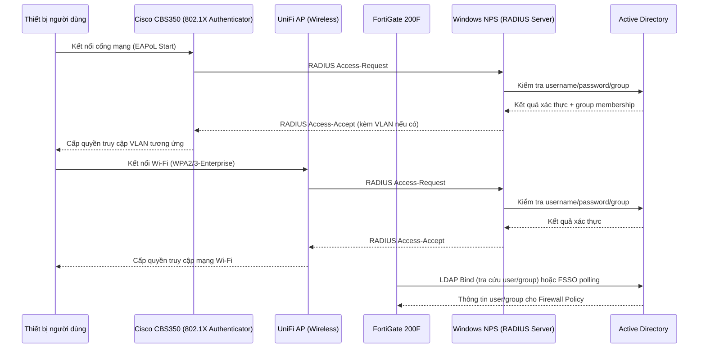
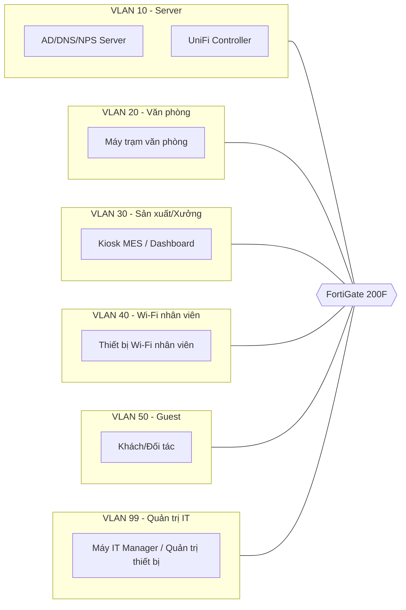

# 🗺️ Sơ đồ hạ tầng mạng tổng thể

## 1. Sơ đồ vật lý/logic tổng thể

```mermaid
flowchart TB
    INTERNET((Internet / ISP))
    FGT[FortiGate 200F<br/>Firewall & Gateway]
    CORE[Cisco CBS350<br/>Core/Distribution Switch]
    SRV_SW[Cisco CBS350<br/>Server Switch - VLAN 10]
    AP_SW[Cisco CBS350<br/>Access Switch - Xưởng]

    DC1[(Windows Server 2012 R2<br/>AD DS + DNS + NPS<br/>10.10.10.10)]
    UNIFI[(UniFi Controller<br/>10.10.10.20)]

    AP1[[UniFi AP - Văn phòng]]
    AP2[[UniFi AP - Xưởng may]]
    AP3[[UniFi AP - Kho]]

    PC_OFFICE[Máy trạm Văn phòng<br/>VLAN 20]
    PC_PROD[Máy trạm/Kiosk Xưởng<br/>VLAN 30]
    PC_MGMT[Máy trạm Quản lý IT<br/>VLAN 99]

    INTERNET --- FGT
    FGT --- CORE
    CORE --- SRV_SW
    CORE --- AP_SW
    SRV_SW --- DC1
    SRV_SW --- UNIFI
    AP_SW --- AP1
    AP_SW --- AP2
    AP_SW --- AP3
    AP_SW --- PC_OFFICE
    AP_SW --- PC_PROD
    CORE --- PC_MGMT

    FGT -.LDAP/RADIUS.-> DC1
    AP_SW -.802.1X RADIUS.-> DC1
    UNIFI -.RADIUS Auth.-> DC1
```

📌 **Ghi chú:** Đây là sơ đồ tham chiếu mẫu. Khi triển khai thực tế tại nhà máy, cập nhật số lượng switch/AP theo đúng hiện trạng và lưu bản cập nhật tại đây — đây là **nguồn sự thật duy nhất** cho sơ đồ mạng.

## 2. Luồng xác thực tổng thể (Authentication Flow)



## 3. Phân vùng mạng theo chức năng (Network Segmentation)



## 4. Nguyên tắc thiết kế phân vùng
- **VLAN 10 (Server):** Cô lập hoàn toàn, chỉ truy cập từ VLAN 99 (quản trị) và các VLAN cần dịch vụ (DNS/AD/RADIUS) theo policy giới hạn.
- **VLAN 30 (Sản xuất):** Không cho phép truy cập Internet trực tiếp trừ khi có nhu cầu cụ thể (cập nhật phần mềm MES) — giảm bề mặt tấn công cho hệ thống vận hành sản xuất.
- **VLAN 50 (Guest):** Cô lập hoàn toàn khỏi các VLAN nội bộ khác, chỉ ra Internet.
- **VLAN 99 (Quản trị IT):** Là VLAN duy nhất có quyền truy cập giao diện quản trị (SSH/HTTPS) của FortiGate, CBS350, UniFi Controller.

> Xem chi tiết địa chỉ IP/VLAN tại [[02_Bang_Dia_Chi_IP_VLAN]].
