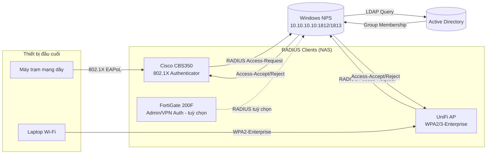

# 📡 Phần 2.1 — Tổng quan NPS/RADIUS

## 1. NPS là gì trong kiến trúc này
**Network Policy Server (NPS)** là dịch vụ RADIUS Server của Microsoft, cài trên chính server AD (`DC01`) hoặc server riêng. NPS đóng vai trò **trung gian xác thực** giữa các thiết bị mạng (CBS350, UniFi AP) và Active Directory — thiết bị mạng không tự tra AD trực tiếp mà gửi yêu cầu RADIUS đến NPS, NPS tra AD rồi trả kết quả.

## 2. Vì sao dùng RADIUS thay vì xác thực cục bộ trên từng thiết bị
| Xác thực cục bộ (local user trên switch/AP) | RADIUS tập trung qua NPS |
|---|---|
| Phải tạo/xoá tài khoản trên từng thiết bị riêng lẻ | Quản lý tập trung 1 nơi (AD) |
| Không đồng bộ khi user nghỉ việc (rủi ro bảo mật) | Vô hiệu hoá AD → mất quyền truy cập toàn bộ ngay lập tức |
| Không phân quyền theo VLAN động được | Gán VLAN động theo AD Group (xem [[06_Tich_Hop_AD_Groups_VLAN]]) |
| Không có audit log tập trung | NPS ghi log tập trung, dễ điều tra sự cố |

## 3. Kiến trúc RADIUS tổng thể

## 4. Các thành phần cần cấu hình (thứ tự triển khai)
1. [[02_Cai_Dat_NPS_Role]] — Cài Role NPS trên server.
2. [[03_Cau_Hinh_RADIUS_Clients]] — Khai báo CBS350/UniFi AP là RADIUS Client hợp lệ.
3. [[05_Trien_Khai_Certificate]] — Cài Certificate cho NPS (bắt buộc cho PEAP).
4. [[04_Cau_Hinh_Network_Policy_PEAP]] — Tạo Connection Request Policy + Network Policy (PEAP-MSCHAPv2).
5. [[06_Tich_Hop_AD_Groups_VLAN]] — Gán VLAN động theo AD Group.

## 5. Cổng dịch vụ RADIUS chuẩn
| Dịch vụ | Port | Giao thức |
|---|---|---|
| RADIUS Authentication | 1812 (UDP) | Chuẩn hiện đại (RFC 2865) |
| RADIUS Accounting | 1813 (UDP) | Chuẩn hiện đại (RFC 2866) |
| RADIUS Authentication (legacy) | 1645 (UDP) | Một số thiết bị cũ vẫn dùng — kiểm tra tài liệu CBS350/UniFi nếu không thấy Access-Request đến NPS |

🔒 Đảm bảo Windows Firewall trên NPS server cho phép UDP 1812/1813 từ các VLAN chứa RADIUS Client (VLAN 10 nơi đặt switch quản trị, và các VLAN uplink switch/AP nếu request đi qua Layer 3).

➡️ Tiếp theo: [[02_Cai_Dat_NPS_Role]]
