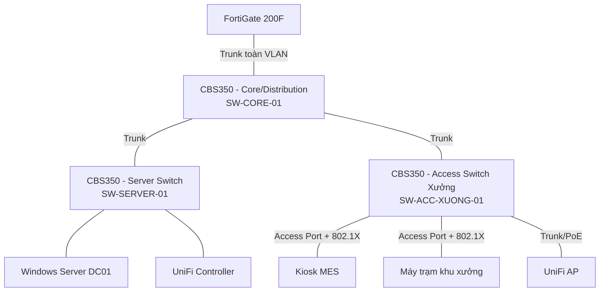

# 🔷 Phần 3.1 — Tổng quan Cisco CBS350

## 1. Giới thiệu dòng thiết bị
Cisco Business 350 Series (CBS350) là dòng switch quản lý được (Managed Switch) hướng đến doanh nghiệp vừa và nhỏ, hỗ trợ đầy đủ: VLAN, Layer 3 lite (static routing cơ bản), 802.1X, Port Security, STP/RSTP/MSTP, LACP, QoS, SNMP. Tài liệu này áp dụng cho **firmware 3.5.3.3**.

📌 CLI của CBS350 tương tự cú pháp Cisco IOS truyền thống nhưng là **bộ lệnh riêng của dòng Business/Small Business** (không phải full Cisco IOS/IOS-XE) — một số lệnh nâng cao trên Catalyst Enterprise sẽ không có trên CBS350. Tài liệu này chỉ dùng lệnh đã xác nhận có trong **Cisco Business 350 Series CLI Guide** chính thức.

## 2. Vai trò trong hạ tầng nhà máy

## 3. Danh sách switch trong hạ tầng mẫu

| Hostname | Vai trò | Số port khuyến nghị | VLAN cấu hình |
|---|---|---|---|
| `SW-CORE-01` | Core/Distribution — trung tâm đấu nối các switch khác và FortiGate | 24-48 port | Trunk toàn bộ VLAN 10/20/30/40/50/99 |
| `SW-SERVER-01` | Access switch khu Server | 8-24 port | Chủ yếu VLAN 10, trunk uplink |
| `SW-ACC-XUONG-01` | Access switch khu Sản xuất | 24-48 port PoE (cấp nguồn AP/kiosk nếu cần) | Access VLAN 30, trunk uplink, 802.1X từng port |
| `SW-ACC-VANPHONG-01` | Access switch khu Văn phòng | 24 port | Access VLAN 20, trunk uplink |

## 4. Phương thức quản trị hỗ trợ
| Phương thức | Khuyến nghị dùng | Ghi chú |
|---|---|---|
| **CLI qua Console cable** | Cấu hình lần đầu (chưa có IP mạng) | Bắt buộc cho bước khởi tạo ban đầu |
| **CLI qua SSH** | Quản trị hàng ngày | 🔒 Tắt Telnet, chỉ dùng SSH |
| **Web GUI (HTTPS)** | Thao tác trực quan, tra cứu nhanh | 🔒 Chỉ cho phép truy cập từ VLAN 99 |
| **SNMP** | Giám sát tập trung (nếu có hệ thống Monitoring) | Dùng SNMPv3, không dùng SNMPv1/v2 (không mã hoá) |

## 5. Luồng tài liệu tiếp theo
1. [[02_Khoi_Tao_Ban_Dau]] — Cấu hình lần đầu qua Console.
2. [[03_Cau_Hinh_VLAN]] — Tạo VLAN, gán port Access/Trunk.
3. [[04_Port_Security_STP_LACP]] — Bảo mật port, chống loop, gộp link.
4. [[05_8021X_RADIUS]] — Xác thực 802.1X qua NPS.
5. [[06_QoS_Nang_Cao]] — QoS và cấu hình nâng cao.
6. [[07_Backup_Firmware]] — Backup cấu hình, nâng cấp firmware.
7. [[08_Troubleshooting_CBS350]] — Xử lý sự cố.
8. [[09_Checklist_Van_Hanh_CBS350]] — Checklist tổng hợp.
