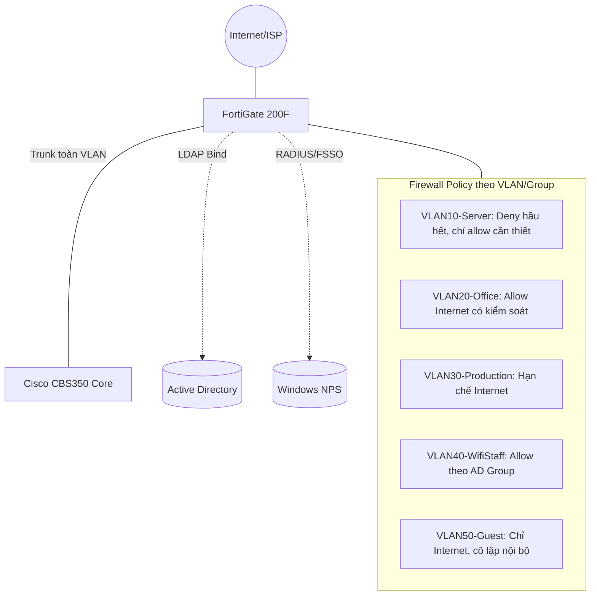

# 🛡️ Phần 4.1 — Tổng quan FortiGate 200F

## 1. Vai trò trong hạ tầng
FortiGate 200F là **Next-Generation Firewall (NGFW)** đóng vai trò gateway trung tâm: định tuyến giữa các VLAN, kiểm soát truy cập Internet, và tích hợp xác thực với AD (LDAP/FSSO) + RADIUS để áp dụng chính sách theo danh tính người dùng (Identity-Based Policy).

## 2. Thông số kỹ thuật liên quan cấu hình (tham khảo)
| Thông số | Giá trị |
|---|---|
| Model | FortiGate 200F |
| Hệ điều hành | FortiOS (khuyến nghị dùng bản 7.x ổn định mới nhất được hỗ trợ) |
| Interface | Nhiều cổng GE RJ45 + SFP, hỗ trợ VDOM (không bắt buộc dùng ở quy mô 1 site) |

📌 Tài liệu này không cố định phiên bản FortiOS cụ thể — cú pháp CLI cơ bản (`config`/`set`/`end`) ổn định qua nhiều bản FortiOS 6.x/7.x, nhưng **luôn đối chiếu FortiOS Administration Guide đúng phiên bản đang chạy** trên thiết bị thật trước khi áp dụng, vì một số tên tham số có thể thay đổi nhỏ giữa các bản.

## 3. Vùng bảo mật (Security Zone) theo VLAN

| Zone | VLAN | Mức tin cậy | Chính sách tổng quát |
|---|---|---|---|
| `zone-server` | 10 | Cao (nội bộ nhạy cảm) | Chỉ cho phép truy cập từ zone quản trị + zone cần dịch vụ (DNS/AD/RADIUS) |
| `zone-office` | 20 | Trung bình | Cho phép Internet có kiểm soát (lọc web, theo AD Group) |
| `zone-production` | 30 | Trung bình-Cao | Hạn chế tối đa Internet, ưu tiên truy cập nội bộ (Dashboard/MES) |
| `zone-wifi-staff` | 40 | Trung bình | Tương tự Office, xác thực qua RADIUS trước khi vào mạng |
| `zone-guest` | 50 | Thấp (không tin cậy) | Cô lập hoàn toàn nội bộ, chỉ ra Internet |
| `zone-mgmt` | 99 | Rất cao | Chỉ nơi duy nhất truy cập giao diện quản trị thiết bị mạng |

## 4. Luồng tài liệu tiếp theo
1. [[02_Khoi_Tao_Ban_Dau]] — Setup ban đầu, đổi mật khẩu, đặt IP.
2. [[03_Interface_VLAN_Zone]] — Cấu hình Interface/VLAN/Zone.
3. [[04_Tich_Hop_LDAP_AD]] — Tích hợp LDAP với AD.
4. [[05_Tich_Hop_RADIUS_FSSO]] — Tích hợp RADIUS/FSSO.
5. [[06_Firewall_Policy_Chuan]] — Firewall Policy theo Zone/Group.
6. [[07_Backup_Restore_Config]] — Backup/Restore.
7. [[08_Hardening_FortiGate]] — Hardening.
8. [[09_Troubleshooting_FortiGate]] — Xử lý sự cố.
9. [[10_Checklist_Van_Hanh_FortiGate]] — Checklist tổng hợp.
