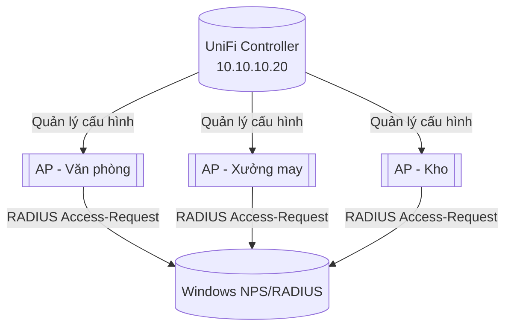

# 📶 Phần 5.1 — Tổng quan UniFi Controller

## 1. Vai trò trong hạ tầng
UniFi Controller (Ubiquiti) quản lý tập trung toàn bộ Access Point (AP) trong nhà máy — cấu hình SSID, VLAN mapping, chính sách Wi-Fi, và (quan trọng nhất trong tài liệu này) xác thực Wi-Fi qua RADIUS (NPS) thay vì Pre-Shared Key (PSK) đơn giản.

## 2. Vì sao dùng RADIUS (WPA2/3-Enterprise) thay vì PSK
| PSK (WPA2-Personal) | RADIUS (WPA2/3-Enterprise) |
|---|---|
| 1 mật khẩu chung cho tất cả — khi 1 người rời công ty, phải đổi mật khẩu cho toàn bộ nhân viên | Mỗi người dùng tài khoản AD riêng — vô hiệu hoá AD là mất quyền truy cập Wi-Fi ngay |
| Không biết ai đang dùng Wi-Fi (chỉ biết địa chỉ MAC) | Log NPS ghi rõ user nào đăng nhập, lúc nào |
| Không phân quyền VLAN theo người dùng được | Gán VLAN động theo AD Group (giống 802.1X mạng dây) |

## 3. Danh sách SSID khuyến nghị

| SSID | VLAN | Xác thực | Đối tượng |
|---|---|---|---|
| `QVN-Staff` | 40 (Wifi-Staff) | WPA2-Enterprise (RADIUS) | Nhân viên nội bộ |
| `QVN-Guest` | 50 (Guest) | Captive Portal / WPA2-Personal riêng | Khách/đối tác |

📌 Không tạo SSID riêng cho khu xưởng sản xuất nếu khu vực này chủ yếu dùng mạng dây (kiosk cố định) — chỉ dùng SSID chung `QVN-Staff` nếu có nhu cầu Wi-Fi di động trong xưởng (VD: tổ trưởng dùng tablet).

## 4. Luồng tài liệu tiếp theo
1. [[02_Cai_Dat_Controller_Adopt_AP]] — Cài Controller, adopt AP.
2. [[03_Tao_Wireless_Network_RADIUS]] — Tạo SSID xác thực RADIUS.
3. [[04_VLAN_Mapping_SSID]] — VLAN mapping động cho SSID.
4. [[05_Guest_Network_Portal]] — Cấu hình Guest Network/Portal.
5. [[06_Backup_Restore_UniFi]] — Backup/Restore.
6. [[07_Troubleshooting_UniFi]] — Xử lý sự cố.
7. [[08_Checklist_Van_Hanh_UniFi]] — Checklist tổng hợp.
