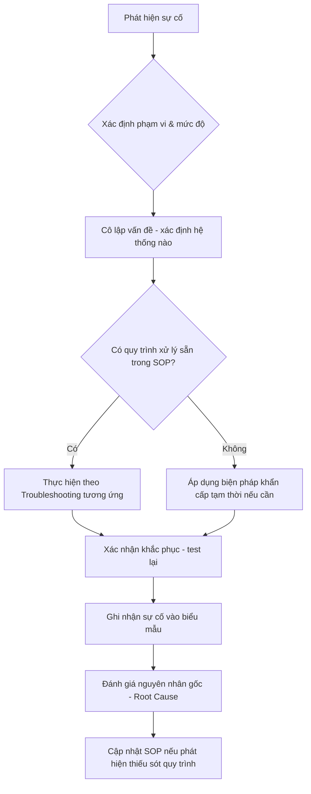

# 🚨 Phần 6.4 — Quy trình xử lý sự cố

## 1. Phân loại mức độ nghiêm trọng sự cố

| Mức độ | Định nghĩa | Ví dụ | Thời gian phản hồi mục tiêu |
|---|---|---|---|
| **P1 - Khẩn cấp** | Toàn bộ hoặc phần lớn nhà máy ngừng kết nối mạng, ảnh hưởng sản xuất trực tiếp | AD/NPS sập → toàn bộ 802.1X/Wi-Fi ngừng xác thực; FortiGate sập → mất Internet + routing nội bộ | Ngay lập tức |
| **P2 - Cao** | 1 khu vực/1 hệ thống bị ảnh hưởng, có ảnh hưởng sản xuất nhưng chưa toàn diện | 1 switch khu xưởng mất kết nối; 1 AP khu vực mất sóng | Trong 1 giờ |
| **P3 - Trung bình** | Ảnh hưởng cục bộ, có giải pháp thay thế tạm thời | 1 port switch lỗi (còn port khác dùng được); Guest Wi-Fi lỗi | Trong ngày |
| **P4 - Thấp** | Không ảnh hưởng vận hành, có thể lên lịch xử lý | Certificate sắp hết hạn (còn nhiều ngày); cần dọn dẹp policy thừa | Theo lịch bảo trì định kỳ |

## 2. Quy trình xử lý sự cố chuẩn (áp dụng mọi mức độ)



## 3. Bảng điều hướng nhanh theo triệu chứng

| Triệu chứng quan sát | Bắt đầu điều tra từ đâu |
|---|---|
| Không đăng nhập được mạng dây/Wi-Fi (802.1X) | [[../02_NPS_RADIUS/07_Troubleshooting_NPS]] → [[../03_Cisco_CBS350/08_Troubleshooting_CBS350]] |
| Không ra được Internet | [[../04_FortiGate_200F/09_Troubleshooting_FortiGate]] |
| 1 khu vực mất mạng hoàn toàn (cả dây lẫn Wi-Fi) | [[../03_Cisco_CBS350/08_Troubleshooting_CBS350]] (kiểm tra switch khu vực trước) |
| Wi-Fi cụ thể 1 khu vực yếu/mất sóng | [[../05_UniFi_Controller/07_Troubleshooting_UniFi]] |
| Không truy cập được tài nguyên nội bộ dù mạng vẫn có Internet | [[../01_Windows_Server_AD/09_Checklist_Van_Hanh_AD]] (kiểm tra AD/DNS trước) |
| Nghi ngờ bị tấn công/truy cập trái phép | [[02_Hardening_Baseline_Tong_The]] mục 3 (Admin Access Matrix) + xem log tất cả thiết bị |

## 4. Nguyên tắc xử lý sự cố P1 (Khẩn cấp)
1. ⚠️ **Ưu tiên khôi phục dịch vụ trước, điều tra nguyên nhân gốc sau** — với sự cố ảnh hưởng sản xuất trực tiếp, dùng các biện pháp khẩn cấp tạm thời đã ghi trong từng phần (VD: `dot1x port-control force-authorized` khi NPS sập, xem [[../03_Cisco_CBS350/05_8021X_RADIUS]] mục 11).
2. Thông báo ngay cho quản lý sản xuất/ban giám đốc nếu sự cố ảnh hưởng trực tiếp đến hoạt động chuyền (theo Escalation Matrix, xem [[06_Escalation_Matrix]]).
3. Sau khi khôi phục tạm thời, tiếp tục điều tra nguyên nhân gốc và khắc phục triệt để — không để giải pháp tạm thời tồn tại vĩnh viễn (rủi ro bảo mật nếu VD: 802.1X bị tắt tạm mà quên bật lại).
4. Ghi nhận đầy đủ timeline sự cố theo biểu mẫu [[../07_Phu_Luc/01_Bieu_Mau]].

## 5. Mẫu biên bản sự cố (Incident Report) — tóm tắt, xem đầy đủ tại Phụ lục
```markdown
## Sự cố: [Tên ngắn gọn]
- Mức độ: P[1-4]
- Thời gian phát hiện:
- Thời gian khắc phục:
- Phạm vi ảnh hưởng:
- Nguyên nhân gốc:
- Biện pháp khắc phục tạm thời:
- Biện pháp khắc phục triệt để:
- Bài học kinh nghiệm / Cập nhật SOP (nếu có):
```

## 6. Sau sự cố — Post-Incident Review
📌 Với mọi sự cố P1/P2, sau khi khắc phục xong, dành thời gian trả lời:
- Nguyên nhân gốc thực sự là gì (không chỉ triệu chứng bề mặt)?
- Quy trình SOP hiện tại có đủ hướng dẫn xử lý không? Nếu không, cập nhật ngay.
- Có thể phát hiện sớm hơn không (cần thêm giám sát/cảnh báo gì)?
- Có cần điều chỉnh kiến trúc (VD: thêm DC dự phòng) để giảm rủi ro tái diễn không?

➡️ Tiếp theo: [[05_Change_Management]]
