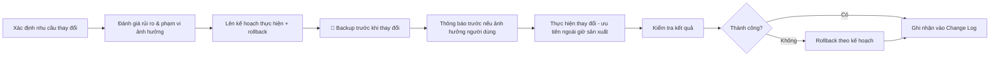

# 🔄 Phần 6.5 — Change Management

## 1. Vì sao cần quy trình thay đổi có kiểm soát ngay cả khi chỉ có 1 IT Manager
📌 Change Management không phải chỉ dành cho đội ngũ lớn — với môi trường 1 người vận hành, đây là cách để: (1) không quên bước quan trọng khi vội, (2) có dấu vết để tra cứu khi có sự cố sau này, (3) người kế nhiệm (nếu có) hiểu được lịch sử thay đổi hệ thống.

## 2. Phân loại thay đổi

| Loại | Định nghĩa | Ví dụ | Yêu cầu quy trình |
|---|---|---|---|
| **Standard Change** | Thay đổi định kỳ, đã quen thuộc, rủi ro thấp | Reset mật khẩu user, thêm 1 user mới vào group | Ghi log đơn giản, không cần duyệt riêng |
| **Normal Change** | Thay đổi có kế hoạch, có thể ảnh hưởng dịch vụ | Thêm VLAN mới, sửa Firewall Policy, nâng cấp firmware | Đầy đủ quy trình bên dưới |
| **Emergency Change** | Thay đổi khẩn cấp để xử lý sự cố P1/P2 | Biện pháp khẩn cấp trong [[04_Xu_Ly_Su_Co]] | Thực hiện ngay, ghi log đầy đủ **ngay sau đó** |

## 3. Quy trình Normal Change (đầy đủ)



## 4. Mẫu Change Request (tóm tắt)
```markdown
## Change: [Tên thay đổi]
- Ngày thực hiện dự kiến:
- Hệ thống ảnh hưởng: [AD/NPS/CBS350/FortiGate/UniFi]
- Lý do thay đổi:
- Mức độ rủi ro: [Thấp/Trung bình/Cao]
- Kế hoạch thực hiện: [các bước]
- Kế hoạch rollback: [nếu lỗi thì làm gì]
- Đã backup trước khi thực hiện? [Có/Không - link file backup]
- Kết quả sau thực hiện:
- Ghi chú:
```
📌 Xem mẫu đầy đủ có thể điền trực tiếp tại [[../07_Phu_Luc/01_Bieu_Mau]].

## 5. Cửa sổ bảo trì (Maintenance Window) khuyến nghị
| Loại thay đổi | Thời điểm khuyến nghị |
|---|---|
| Thay đổi ảnh hưởng khu Sản xuất (VLAN 30, switch xưởng) | Ngoài giờ sản xuất, khuyến nghị sau 20:00 hoặc cuối tuần nếu nhà máy nghỉ |
| Thay đổi ảnh hưởng khu Văn phòng (VLAN 20) | Ngoài giờ hành chính, hoặc giờ nghỉ trưa nếu thay đổi nhỏ/nhanh |
| Thay đổi FortiGate/Core Switch (ảnh hưởng toàn hệ thống) | Cuối tuần hoặc khung giờ nhà máy tạm dừng hoạt động, luôn thông báo trước |
| Nâng cấp firmware (mọi thiết bị) | Cuối tuần, có UPS ổn định, không thực hiện cuối ngày làm việc (đề phòng cần thời gian xử lý nếu lỗi) |

## 6. Nguyên tắc "không thay đổi khi không có kế hoạch rollback"
🔒 Trước khi thực hiện **bất kỳ** Normal Change nào, phải trả lời được câu hỏi: *"Nếu thay đổi này gây lỗi, tôi sẽ làm gì để đưa hệ thống về trạng thái hoạt động trong thời gian ngắn nhất?"* — nếu không có câu trả lời rõ ràng, chưa nên thực hiện thay đổi.

## 7. Lưu trữ lịch sử thay đổi
📌 Toàn bộ Change Request (kể cả Emergency Change ghi lại sau) lưu tại [[../07_Phu_Luc/02_Lich_Su_Thay_Doi]] — đây là nguồn tham chiếu quan trọng khi điều tra sự cố hoặc bàn giao công việc.

➡️ Tiếp theo: [[06_Escalation_Matrix]]
