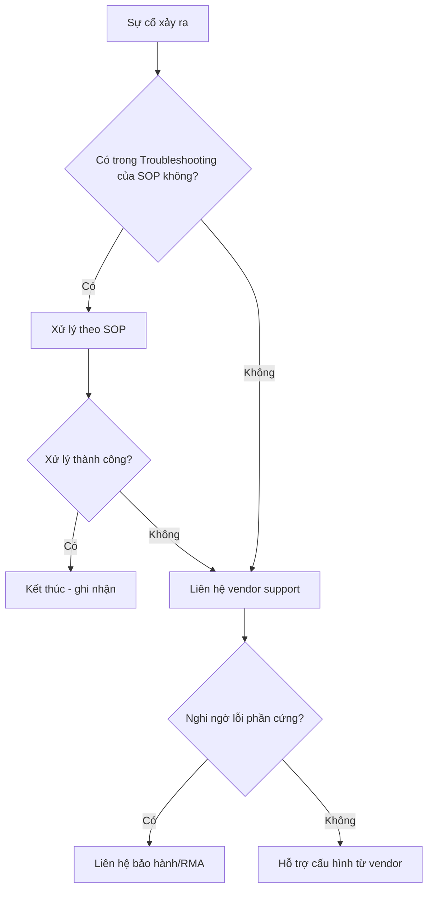

# 📞 Phần 6.6 — Escalation & Liên hệ hỗ trợ

## 1. Nguyên tắc chung
📌 Với mô hình 1 IT Manager, "escalation nội bộ" gần như không tồn tại — quan trọng hơn là biết **khi nào cần gọi hỗ trợ bên ngoài** (vendor support) thay vì tự xử lý kéo dài một sự cố vượt khả năng hoặc vượt phạm vi tài liệu này.

## 2. Bảng liên hệ hỗ trợ theo hệ thống (điền thông tin thực tế khi triển khai)

| Hệ thống | Nhà cung cấp | Kênh hỗ trợ | Thông tin hợp đồng/license | Khi nào gọi |
|---|---|---|---|---|
| Windows Server / AD | Microsoft (hoặc đối tác triển khai) | [Điền số hotline/email hỗ trợ] | [Số hợp đồng nếu có Premier Support] | Lỗi AD DB corrupt không tự khôi phục được, cần ESU cho Server 2012 R2 |
| Cisco CBS350 | Cisco (hoặc đại lý bán thiết bị) | [Điền thông tin] | [Số serial/warranty] | Nghi ngờ lỗi phần cứng, cần security advisory mới nhất |
| FortiGate 200F | Fortinet (FortiCare) | support.fortinet.com | [Số FortiCare contract] | Lỗi phần cứng, cần hỗ trợ cấu hình nâng cao, license issue |
| UniFi | Ubiquiti Community/Support | community.ui.com | [Số serial thiết bị] | Lỗi phần cứng AP, bug phần mềm Controller |
| ISP (đường truyền Internet) | [Tên nhà mạng] | [Hotline hỗ trợ kỹ thuật] | [Mã số thuê bao] | WAN down không do thiết bị nội bộ |
| Đơn vị triển khai/tích hợp hệ thống (nếu có) | [Tên công ty] | [Liên hệ] | [Hợp đồng bảo trì] | Sự cố phức tạp vượt khả năng xử lý nội bộ |

## 3. Quy trình quyết định khi nào cần hỗ trợ bên ngoài

## 4. Thông tin cần chuẩn bị trước khi liên hệ hỗ trợ vendor
📌 Chuẩn bị sẵn để rút ngắn thời gian xử lý:
- [ ] Model + Serial Number thiết bị.
- [ ] Phiên bản Firmware/OS hiện tại.
- [ ] Mô tả sự cố chi tiết + thời điểm bắt đầu.
- [ ] Log liên quan (export từ `show logging`, Event Viewer, Forward Traffic log...).
- [ ] Các bước đã thử xử lý theo SOP này.
- [ ] File backup cấu hình gần nhất (đôi khi vendor yêu cầu để phân tích).

## 5. Danh bạ nội bộ (điền khi triển khai thực tế)
| Vai trò | Tên | Liên hệ | Ghi chú |
|---|---|---|---|
| IT Manager (chính) | [Điền tên] | [Điện thoại/email] | Người vận hành chính toàn bộ hệ thống |
| Quản lý sản xuất | [Điền tên] | [Điện thoại] | Cần thông báo khi sự cố ảnh hưởng chuyền sản xuất |
| Ban giám đốc (khi sự cố nghiêm trọng) | [Điền tên] | [Điện thoại] | Chỉ liên hệ với sự cố P1 kéo dài/ảnh hưởng kinh doanh rõ rệt |
| Đối tác/nhà thầu bảo trì mạng (nếu có) | [Điền tên công ty] | [Liên hệ] | Hỗ trợ khi vượt khả năng xử lý nội bộ |

🔒 Với thông tin liên hệ và hợp đồng — không lưu chi tiết nhạy cảm (số hợp đồng, mã bảo hành đầy đủ) trong bản tài liệu chia sẻ rộng rãi nếu vault Obsidian có nhiều người truy cập; cân nhắc tách riêng phần này vào ghi chú bảo mật hạn chế truy cập nếu cần.

➡️ Xem thêm: [[../07_Phu_Luc/01_Bieu_Mau|Biểu mẫu chuẩn]]
